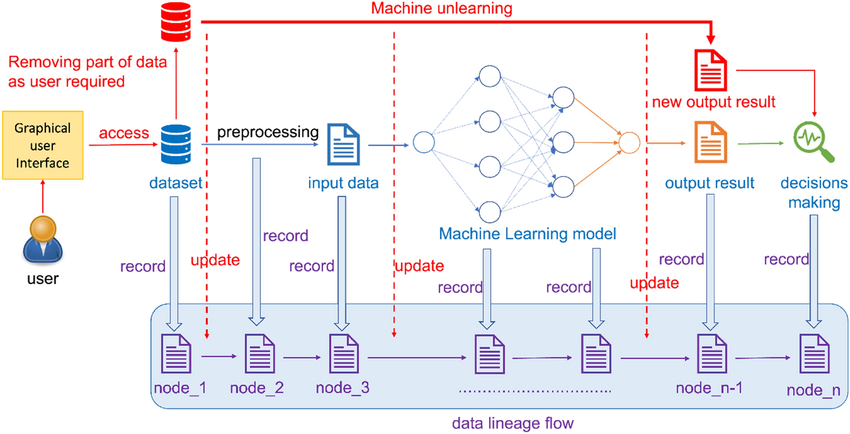

# Specification of JiaoziFS.

## Dataset linage management

Data lineage management for machine learning data flows recording and machine unlearning updating. For each step in the machine learning system, from the original dataset to optimizing each parameter in the training process to getting the final training results and analyzing the results, all data and changes will be recorded in the data lineage management system. This series of records of data flow characteristics and changes allow developers to control and track any subtle differences in the model learning process at any time

Version Control for ML Models: Why You Need It, What It Is, How To Implement It
https://neptune.ai/blog/version-control-for-ml-models

Machine Learning Pipelines: Provenance, Reproducibility and FAIR Data Principles
https://arxiv.org/pdf/2006.12117.pdf

Teaching Software Engineering for AI-Enabled Systems
https://arxiv.org/pdf/2001.06691.pdf

Dataset Management Platform for Machine Learning
https://arxiv.org/pdf/2303.08301.pdf

Managing Dataset Versions in Long-Term ML Projects
https://neptune.ai/blog/managing-dataset-versions-in-long-term-ml-projects

CS839 - Data Management for Machine Learning Applications (Spring 2018)
https://thodrek.github.io/CS839_spring18/

Data Management for Machine Learning: A Survey
https://luoyuyu.vip/files/DM4ML_Survey.pdf

Machine Learning for Data Management: A System View
https://dbgroup.cs.tsinghua.edu.cn/ligl/papers/ai4db-slides.pdf

Machine Learning for Data Management: A System View
https://dbgroup.cs.tsinghua.edu.cn/ligl/papers/icde22-tutorial-paper.pdf

DM4ML_Survey.pdf - Google Drive
https://drive.google.com/file/d/1Ye9PUFrjhjFYX-qDb5D3Q5LlKQtxtsF3/view

Microsoft PowerPoint - 1_Introduction.pptx
https://pdfs.semanticscholar.org/fd53/5070a5aa6b6d18bf57a4b84fbc1e8e0937ca.pdf

The Data Engineering Lifecycle. A primer into the 5 key components of… | by Dom N | Medium
https://medium.com/@dom.n/the-data-engineering-lifecycle-5c67bf6fb540

Data lineage: Data origination and where it moves over time | Deloitte Netherlands
https://www2.deloitte.com/nl/nl/pages/financial-services/articles/data-lineage.html

Understanding the Importance of Data Lineage in Modern Data Management - Simple Talk
https://www.red-gate.com/simple-talk/development/other-development/understanding-the-importance-of-data-lineage-in-modern-data-management/

Data Lineage : Examples, Concepts and Techniques | decube
https://www.decube.io/post/data-lineage-examples-concepts-and-techniques

Data Lineage and Data Quality: How They Intersect - DATAVERSITY
https://www.dataversity.net/data-lineage-and-data-quality-how-they-intersect/

Webinar: How Automating Data Lineage Improves BI Performance - DATAVERSITY
https://www.dataversity.net/webinar-how-automating-data-lineage-improves-bi-performance/

Data Governance Tools Support Data Management - DATAVERSITY
https://www.dataversity.net/data-governance-tools-support-data-management/

Machine Learning Pipeline: Architecture of ML Platform
https://www.altexsoft.com/blog/machine-learning-pipeline/

# Machine Unlearning

A Survey of Machine Unlearning
https://arxiv.org/pdf/2209.02299.pdf

Machine Unlearning: A Survey
https://arxiv.org/pdf/2306.03558.pdf

## Model Registry

MLflow Model Registry — MLflow 2.11.3 documentation
https://mlflow.org/docs/latest/model-registry.html

## Edge ML

Edge ML Solutions for Real-Time Insights | Expanso
https://expanso.io/use-cases/edge-machine-learning/

Intel® Liftoff Member Expanso Takes ML/AI to the Edge with Intel® Hardware - Intel Community
https://community.intel.com/t5/Blogs/Tech-Innovation/Artificial-Intelligence-AI/Intel-Liftoff-Member-Expanso-Takes-ML-AI-to-the-Edge-with-Intel/post/1575901

## Machine Learning in Production / AI Engineering

Home · cmuvariability/PaperReadingGroup Wiki
https://github.com/cmuvariability/PaperReadingGroup/wiki

Christian Kästner :: CMU
https://www.cs.cmu.edu/~ckaestne/

Machine Learning in Production / AI Engineering
https://ckaestne.github.io/seai/

Christian Kästner – Medium
https://ckaestne.medium.com/

Versioning, Provenance, and Reproducibility in Production Machine Learning | by Christian Kästner | Medium
https://ckaestne.medium.com/versioning-provenance-and-reproducibility-in-production-machine-learning-355c48665005

Machine Learning in Production: From Models to Products | by Christian Kästner | Medium
https://ckaestne.medium.com/machine-learning-in-production-book-overview-63be62393581

Dataset Management Platform for Machine Learning
https://arxiv.org/pdf/2303.08301.pdf

Dataset + File Management — Dataverse.org
https://guides.dataverse.org/en/5.11.1/user/dataset-management.html

## LLM

Mauve 👁💜: "Video of my talk about making an #OpenSource #LLM…" - Mauvestodon
https://mastodon.mauve.moe/@mauve/112134166517219130
https://youtu.be/GztPt4Yhl8M

## Data-Centric AI
Data-centric AI Resource Hub
https://datacentricai.org/

Introduction to Data-Centric AI
https://dcai.csail.mit.edu/

Data-Centric AI | What is Data-Centric AI & Why Does It Matter?
https://landing.ai/data-centric-ai/

Data-centric Artificial Intelligence: A Survey
https://arxiv.org/abs/2303.10158

Andrew Ng "The Data-Centric AI Approach" - YouTube
https://www.youtube.com/watch?v=TU6u_T-s68Y

[KDD 2023 Tutorial] Data-centric AI: Techniques and Future Perspectives - YouTube
https://www.youtube.com/watch?v=6WjHpFeOgQ0

Data-centric AI: A new paradigm - YouTube
https://www.youtube.com/watch?v=2OlzQ295oCk

daochenzha/data-centric-AI: A curated, but incomplete, list of data-centric AI resources.
https://github.com/daochenzha/data-centric-AI

Data-centric AI: a complete primer | Snorkel AI
https://snorkel.ai/data-centric-ai-primer/

Data-Centric AI: What it is & 3 Best Practices to Adopt It in 2024
https://research.aimultiple.com/data-centric-ai/

What is Data-Centric AI? // van der Schaar Lab
https://www.vanderschaar-lab.com/dc-check/what-is-data-centric-ai/

An Absolute Beginner’s Guide to Data-Centric AI | by Arunn Thevapalan | Geek Culture | Medium
https://medium.com/geekculture/an-absolute-beginners-guide-to-data-centric-ai-7127398df05d

Andrew Ng: Unbiggen AI - IEEE Spectrum
https://spectrum.ieee.org/andrew-ng-data-centric-ai

datagen.tech
https://datagen.tech/guides/data-training/data-centric-ai/

Why it’s time for 'data-centric artificial intelligence' | MIT Sloan
https://mitsloan.mit.edu/ideas-made-to-matter/why-its-time-data-centric-artificial-intelligence

Definition of Data-Centric AI - IT Glossary | Gartner
https://www.gartner.com/en/information-technology/glossary/data-centric-ai

Systematic review of data-centric approaches in artificial intelligence and machine learning - ScienceDirect
https://www.sciencedirect.com/science/article/pii/S2666764923000279

Data-centric AI | The ODI
https://theodi.org/insights/projects/data-centric-ai/

Data-Centric Approach vs Model-Centric Approach in Machine Learning
https://neptune.ai/blog/data-centric-vs-model-centric-machine-learning

Data-Centric AI | Community
https://datacentricai.community/

DCAI Tutorial
https://dcaitutorial.github.io/

[2301.04819] Data-centric AI: Perspectives and Challenges
https://arxiv.org/abs/2301.04819

DMLR
https://dmlr.ai/

Data-Centric Artificial Intelligence | Business & Information Systems Engineering
https://link.springer.com/article/10.1007/s12599-024-00857-8

What Is Data-Centric AI All About? - DATAVERSITY
https://www.dataversity.net/what-is-data-centric-ai-all-about/

Data-Centric Artificial Intelligence Technology – HKUST FOK YING TUNG GRADUATE SCHOOL (GUANGZHOU)
https://fytgs.hkust-gz.edu.cn/programs/2023-24/information-hub-2023-24/data-centric-artificial-intelligence-technology

Data Centric AI. Figure 1.1: What is an AI system [1] | by aiXplain | Medium
https://medium.com/@aixplain/data-centric-ai-92e7c6ae4bf0

Introduction to Data-Centric AI - YouTube
https://www.youtube.com/@dcai-course

The Principles of Data-Centric AI | Communications of the ACM
https://dl.acm.org/doi/10.1145/3571724

Data-Centric AI // van der Schaar Lab
https://www.vanderschaar-lab.com/data-centric-ai/

Data Centric Artificial Intelligence: A Beginner’s Guide | SpringerLink
https://link.springer.com/book/10.1007/978-981-99-6353-9

Introduction to data-centric AI | RST Software
https://www.rst.software/blog/introduction-to-data-centric-ai

Data-Centric AI Manifesto: The Future of AI is Now
https://kili-technology.com/data-labeling/machine-learning/data-centric-ai-manifesto

Machine Learning and Big Data Platforms
https://datacentric.ai/index.html

Data-Centric AI: Optimizing Data for Generative AI Fine-Tuning
https://innodata.com/data-centric-ai-optimizing-data-for-generative-ai-fine-tuning/

Data-Centric-AI-Community/awesome-data-centric-ai: Open-Source Software, Tutorials, and Research on Data-Centric AI 🤖
https://github.com/Data-Centric-AI-Community/awesome-data-centric-ai

Data-Centric AI and How to Adopt This Approach
https://valohai.com/blog/data-centric-ai/

The Paradigm Shift from Model-Centric to Data-Centric AI - The New Stack
https://thenewstack.io/the-paradigm-shift-from-model-centric-to-data-centric-ai/

What is Data-Centric AI
https://dagshub.com/glossary/data-centric-ai/

The Future of Data-Centric AI 2023 - Free AI Conference | Snorkel AI
https://future.snorkel.ai/

HazyResearch/data-centric-ai: Resources for Data Centric AI
https://github.com/HazyResearch/data-centric-ai

Data-Centric-AI-Community/awesome-data-centric-ai: Open-Source Software, Tutorials, and Research on Data-Centric AI 🤖
https://github.com/Data-Centric-AI-Community/awesome-data-centric-ai

Data-Centric AI Community
https://github.com/Data-Centric-AI-Community

Introduction to Data-Centric AI
https://github.com/dcai-course

## DeSci & FAIR Digital Objects & Research Objects

Cumulus Encrypted Storage System
https://cess.cloud/

Research Object to capture the Research Life Cycle — The Turing Way
https://the-turing-way.netlify.app/communication/research-objects.html

the-turing-way/README-translated/README-Chinese.md at main · the-turing-way/the-turing-way
https://github.com/the-turing-way/the-turing-way/blob/main/README-translated/README-Chinese.md

Welcome — The Turing Way
https://the-turing-way.netlify.app/index.html

Data Organization - Data Management - Library Guides at Tulane University
https://libguides.tulane.edu/datamanagement/dataorg

HEP-DOMA
https://indico.cern.ch/event/669506/contributions/2794353/attachments/1560641/2456691/HEP-DOMA.pdf

1707.05731.pdf
https://arxiv.org/pdf/1707.05731.pdf

research_objects_practical guide.pdf
https://eprints.ncrm.ac.uk/id/eprint/4465/1/research_objects_practical%20guide.pdf

09_buergermeister.pdf
https://kups.ub.uni-koeln.de/10654/1/09_buergermeister.pdf

Version control, corrections, and retractions - Crossref
https://www.crossref.org/documentation/crossmark/version-control-corrections-and-retractions/

Microsoft Word - Article_DAMALOS23_versioning_v8.1.docx
https://hal.science/hal-04094847/document

Research Object to capture the Research Life Cycle — The Turing Way
https://the-turing-way.netlify.app/communication/research-objects.html

Enabling FAIR research in Earth Science through research objects - ScienceDirect
https://www.sciencedirect.com/science/article/abs/pii/S0167739X18314638

Publications | Free Full-Text | FAIR Digital Objects for Science: From Data Pieces to Actionable Knowledge Units
https://www.mdpi.com/2304-6775/8/2/21

Managing Open and Reproducible Computational Projects: An introduction to version control
https://carpentries-incubator.github.io/managing-computational-projects/instructor/05-versioncontrol.html

Version Control — The Turing Way
https://the-turing-way.netlify.app/reproducible-research/vcs.html

Welcome — The Turing Way
https://book.the-turing-way.org/

Applied Sciences | Free Full-Text | Peer-to-Peer System Design Trade-Offs: A Framework Exploring the Balance between Blockchain and IPFS
https://www.mdpi.com/2076-3417/11/21/10012

Towards Decentralised Open Science with Blockchains
https://eprints.soton.ac.uk/478122/1/M_HOFFMAN_Thesis.pdfa.pdf

Decentralized Science: what is it and how it works | LinkedIn
https://www.linkedin.com/pulse/decentralized-science-what-how-works-desci-gosh/?trackingId=KyaEzBhzSzKfXBteYVAeOA%3D%3D

Advancing Open Science with Version Control and Blockchains
https://cs.gmu.edu/~tlatoza/papers/AdvancingOpenScienceWithVersionControlAndBlockchains.pdf

Decentralizing science: Towards an interoperable open peer review ecosystem using blockchain - ScienceDirect
https://www.sciencedirect.com/science/article/pii/S0306457321002089

Decentralizing science: : Towards an interoperable open peer review ecosystem using blockchain: Information Processing and Management: an International Journal: Vol 58, No 6
https://dl.acm.org/doi/10.1016/j.ipm.2021.102724

Frontiers | A Framework Proposal for Blockchain-Based Scientific Publishing Using Shared Governance
https://www.frontiersin.org/articles/10.3389/fbloc.2019.00019/full

Decentralizing science: Towards an interoperable open peer review ecosystem using blockchain - ScienceDirect
https://www.sciencedirect.com/science/article/pii/S0306457321002089

Decentralizing science: Towards an interoperable open peer review ecosystem using blockchain - ScienceDirect
https://www.sciencedirect.com/science/article/pii/S0306457321002089

Revolutionizing Scientific Research: Decentralized Science Explained
https://www.aharonofftechtales.com/2024/03/revolutionizing-scientific-research.html

布莱恩·莱勒
https://www.bryanlehrer.com/entries/new-internet/

Research objects unlock science’s potential | DeSci Labs #Science - YouTube
https://www.youtube.com/watch?v=CKUJYMVBo68

Research object versioning | DeSci Labs #crypto #data #blockchain - YouTube
https://www.youtube.com/watch?v=XfmstsZ4XBw

Research Object - Wikipedia
https://en.wikipedia.org/wiki/Research_Object

Research object | DeSci Codex
https://codex.desci.com/data-layer-definition/entities/research-object

## Pipeline

What Is A Data Pipeline For Machine Learning? | Pachyderm
https://www.pachyderm.com/blog/what-is-a-data-pipeline-for-machine-learning/

Data Pipeline and Data Lifecycle management. | by Kiran Mainali | Big Data Processing | Medium
https://medium.com/big-data-processing/data-pipeline-and-data-lifecycle-management-68cd0d60871b

FAIR data pipeline: provenance-driven data management for traceable scientific workflows
https://www.scienceopen.com/document_file/e8e0a2e9-c6d3-498a-867a-37322878e613/PubMedCentral/e8e0a2e9-c6d3-498a-867a-37322878e613.pdf

Data-Centric AI: AI Models Are Only as Good as Their Data Pipeline
https://hai.stanford.edu/news/data-centric-ai-ai-models-are-only-good-their-data-pipeline

Version Control for Every Data Workflow
https://www.shipyardapp.com/blog/version-control-every-data-workflow/

Version Control for Machine Learning and Data Science
https://neptune.ai/blog/version-control

Why Data Versioning is Critical for AI and Machine Learning | by xpresso ai | Medium
https://xpressoai.medium.com/why-data-versioning-is-critical-for-ai-and-machine-learning-7700f69d9db9

## database versioning
Database Versioning. Introduction - | by Nishant Saxena | javascript-important-facts | Medium
https://medium.com/versioning-in-database-mongodb-versioning-vermongo/database-versioning-7cf59a729bb3

## modern data infra

How to Build Data Products? Deploy: Part 3/4
https://moderndata101.substack.com/p/how-to-build-data-products-deploy

All things DataOS
https://dataos.info/#bearing-the-weight-of-rapid-tech-evolution

Data Operating System - Data Operating System
https://data-operating-system.com/

## Machine Learning Checkpointing

Checkpoints in Deep Learning
https://www.indusmic.com/post/checkpoints-in-deep-learning

Checkpointing in machine learning is the technique of preserving intermediate models throughout the training process to resume training from the most recent point in the event of a system breakdown or stoppage. It entails regularly preserving a neural network’s or checkpoint machine learning model’s weights, biases, and other parameters during training, restoring the model to a prior state if training is halted or fails.

Checkpointing, in addition to allowing the restart of training in the event of a failure or interruption, may be beneficial for monitoring the development of a model during training and spotting possible concerns early on. Saving the model at regular intervals allows you to monitor the model’s performance over time and find patterns or anomalies that may need attention.

### Design
The following are the general steps for checking a model:

1. Design the model architecture– Create your own deep learning model architecture or use pre-trained models.  
2. Optimizer and loss function– Choose the optimizer and loss function that will be utilized during training.  
3. Checkpointing directory– Set the directory where you want the model checkpoints saved.  
4. Checkpointing Callback– To store the model checkpoints, create a checkpointing callback object that will be invoked throughout training. This is possible with TensorFlow and Keras by using the ‘ModelCheckpoint’ function. To store the ckpt model in PyTorch, use the ‘torch.save()’ method.  
5. Form the model– Use the ‘fit()’ function in TensorFlow or Keras or the ‘train()’ method in PyTorch to train the deep learning model. The checkpointing callback will store model checkpoints at predefined intervals throughout training.  
6. Load the checkpoints– In TensorFlow and Keras, use the ‘load_weights()’ function or the torch to restart training from a prior checkpoint. To load the stored model checkpoints, use PyTorch’s torch.load() method.  
7. To save time and resources and guarantee that your model is trained to its maximum potential, it is recommended to checkpoint deep learning models throughout training.  

# Reference

## Data Hub

Collaborative Data Analytics with DataHub
https://www.vldb.org/pvldb/vol8/p1916-bhardwaj.pdf

DataHub: Collaborative Data Science & Dataset Version Management at Scale
https://arxiv.org/pdf/1409.0798.pdf

## Data Centric AI

Compared to model-centric AI, Data-centric AI pays more attention to data processing like data cleaning and labeling instead of model structure design, avoiding garbage in, garbage out.

**Streaming Data Sink.** JiaoziFS uses the sink to periodically collect the data from the connected streaming system and save it into different partitions. These data partitions will be tagged according to their arrival time and used for later training and evaluation.

**Pipeline Registry.** This module enables users to build a data-centric pipeline with ease by introducing flexible APIs. These APIs cover dataset I/O, pipeline staging, and running environment management, speeding up the development of a DataCI pipeline. Furthermore, a versioning control function is introduced to track the pipeline lineage.

**Data-centric Function Zoo.** we provide this module to store data processing methods such as data selection, data augmentation, and tricks applied in a specific scenario (e.g., prompting). Users can share and reuse the functions for pipeline building.

**Pipeline Orchestration.** To run a data-centric pipeline, we leverage the idea from pipeline orchestration systems like  Airflow. The data flow shown will pass through every pre-defined stage in the pipeline and then trigger the evaluation to test the whole pipeline and know the benefit of the new data-centric function. If the pipeline further passes the A/B test, the new function or the new pipeline can be deployed to the product.

**Leaderboard.** Once the evaluation is finished, the results will be sent to the leaderboard. We use the {run #No.} as the index and store the pipeline name with version, the evaluation dataset, the model name with training hype parameters, and the metric for easy reproduction and comparison.

Data-centric AI has shown promising results in many domains:

DataCI: A Platform for Data-Centric AI on Streaming Data
https://arxiv.org/pdf/2306.15538.pdf

Data-centric Artificial Intelligence: A Survey
https://arxiv.org/pdf/2303.10158.pdf

Segment Anything:
https://arxiv.org/pdf/2304.02643.pdf

Segment Anything | Meta AI
https://segment-anything.com/

facebookresearch/segment-anything: The repository provides code for running inference with the SegmentAnything Model (SAM), links for downloading the trained model checkpoints, and example notebooks that show how to use the model.
https://github.com/facebookresearch/segment-anything

DataCLUE: A Benchmark Suite for Data-centric NLP
https://arxiv.org/pdf/2111.08647.pdf

A data-centric framework for composable NLP workflows.
https://arxiv.org/pdf/2103.01834.pdf

Models in the Loop: Aiding Crowdworkers with Generative Annotation Assistants
https://arxiv.org/pdf/2112.09062.pdf

ModelPS: An Interactive and Collaborative Platform for Editing Pre-trained Models at Scale
https://arxiv.org/pdf/2105.08275.pdf

Adversarial Nibbler: A Data-Centric Challenge for Improving the Safety of Text-to-Image Models
https://arxiv.org/pdf/2305.14384.pdf

Active-Learning-as-a-Service: An Automatic and Efficient MLOps System for Data-Centric AI
https://arxiv.org/pdf/2207.09109.pdf

Rethinking Streaming Machine Learning Evaluation
https://arxiv.org/pdf/2205.11473.pdf

Towards A Platform and Benchmark Suite for Model Training on Dynamic Datasets
https://anakli.inf.ethz.ch/papers/MLonDynamicData_EuroMLSys23.pdf

Transformers: State-of-the-Art Natural Language Processing
https://arxiv.org/pdf/1910.03771.pdf

Automatic differentiation in pytorch
https://openreview.net/pdf/25b8eee6c373d48b84e5e9c6e10e7cbbbce4ac73.pdf?ref=blog.premai.io

Hello from Awesome AI Engineering | Awesome AI Engineering
https://ai-engineering.club/

HuaizhengZhang/Awesome-System-for-Machine-Learning: A curated list of research in machine learning systems (MLSys). Paper notes are also provided.
https://github.com/HuaizhengZhang/Awesome-System-for-Machine-Learning?tab=readme-ov-file

MLSysOps/Active-Learning-as-a-Service: A scalable & efficient active learning/data selection system for everyone.
https://github.com/MLSysOps/Active-Learning-as-a-Service

About versioning ontologies or any digital objects with clear semantics
https://hal.science/hal-04094847/document

Unmasking and Improving Data Credibility: A Study with Datasets for Training Harmless Language Models
https://arxiv.org/pdf/2311.11202.pdf

Docta-ai/docta: A Doctor for your data
https://github.com/Docta-ai/docta

## Data Products

An Operating Model for Data Products | by Eric Broda | Towards Data Science
https://towardsdatascience.com/an-operating-model-for-data-products-fba6b268f698

How to Build Data Products? Deploy: Part 3/4
https://moderndata101.substack.com/p/how-to-build-data-products-deploy

Machine Learning Models for Data Product Development
https://www.scribbledata.io/blog/machine-learning-models-for-data-product-development-a-complete-guide/

What Exactly is a Data Product?. This blog has taken much longer to… | by Sanjeev Mohan | Data Mesh Learning | Medium
https://medium.com/data-mesh-learning/what-exactly-is-a-data-product-7f6935a17912

Data as a product vs data products. What are the differences? | by Xavier Gumara Rigol | Towards Data Science
https://towardsdatascience.com/data-as-a-product-vs-data-products-what-are-the-differences-b43ddbb0f123

Data Mesh — AI/ML Model Output Data Products | by Johan Louwers | Medium
https://louwersj.medium.com/data-mesh-ai-ml-model-output-data-products-2de7612cfae3

Use AI & ML to Build Great Data Products
https://www.acceldata.io/article/how-data-observability-ensures-successful-ai-ml-data-products

Semantic Versioning for Data Products | by Miklós Koren | Data Architect | Medium
https://medium.com/data-architect/semantic-versioning-for-data-products-2b060962093

Versioning, Cataloging, and Decommissioning Data Products
https://moderndata101.substack.com/p/managing-the-evolving-data-products-landscape-p2

(1) Data Products: Tutorial & Best Practices | LinkedIn
https://www.linkedin.com/pulse/data-products-tutorial-best-practices-nexla/

Machine Learning Models for Data Product Development
https://www.scribbledata.io/blog/machine-learning-models-for-data-product-development-a-complete-guide/

An Operating Model for Data Products | by Eric Broda | Towards Data Science
https://towardsdatascience.com/an-operating-model-for-data-products-fba6b268f698

How to Build Data Products? Deploy: Part 3/4
https://moderndata101.substack.com/p/how-to-build-data-products-deploy

What Exactly is a Data Product?. This blog has taken much longer to… | by Sanjeev Mohan | Data Mesh Learning | Medium
https://medium.com/data-mesh-learning/what-exactly-is-a-data-product-7f6935a17912

Data as a product vs data products. What are the differences? | by Xavier Gumara Rigol | Towards Data Science
https://towardsdatascience.com/data-as-a-product-vs-data-products-what-are-the-differences-b43ddbb0f123

Data Mesh — AI/ML Model Output Data Products | by Johan Louwers | Medium
https://louwersj.medium.com/data-mesh-ai-ml-model-output-data-products-2de7612cfae3

Use AI & ML to Build Great Data Products
https://www.acceldata.io/article/how-data-observability-ensures-successful-ai-ml-data-products

Semantic Versioning for Data Products | by Miklós Koren | Data Architect | Medium
https://medium.com/data-architect/semantic-versioning-for-data-products-2b060962093

Versioning, Cataloging, and Decommissioning Data Products
https://moderndata101.substack.com/p/managing-the-evolving-data-products-landscape-p2

## Data Copilot

2306.07209.pdf
https://arxiv.org/pdf/2306.07209.pdf

Overview of Copilot for Data Science and Data Engineering in Microsoft Fabric (preview) - Microsoft Fabric | Microsoft Learn
https://learn.microsoft.com/en-us/fabric/get-started/copilot-notebooks-overview

Convergence White Paper PUBLICATION 20240321.pdf
https://assets.arkinvest.com/media-8e522a83-1b23-4d58-a202-792712f8d2d3/ff76349d-7983-4384-899f-a105178f886c/Convergence%20White%20Paper%20PUBLICATION%2020240321.pdf

## Data lineage

Data Lineage in Machine Learning: Methods and Best Practices
https://neptune.ai/blog/data-lineage-in-machine-learning

Data lineage: Making artificial intelligence smarter | SAS
https://www.sas.com/en_us/insights/articles/data-management/data-lineage--making-artificial-intelligence-smarter.html

Data Lineage | Data And Beyond
https://medium.com/data-and-beyond/csi-data-solving-the-mysteries-of-your-datas-past-and-present-with-data-lineage-a15c4e351e

Data Lineage – Towards Data Science
https://towardsdatascience.com/tagged/data-lineage

# Specification of JiaoziFS.

# Reference

## Data Hub

Collaborative Data Analytics with DataHub
https://www.vldb.org/pvldb/vol8/p1916-bhardwaj.pdf

DataHub: Collaborative Data Science & Dataset Version Management at Scale
https://arxiv.org/pdf/1409.0798.pdf

## Data Centric AI

Compared to model-centric AI, Data-centric AI pays more attention to data processing like data cleaning and labeling instead of model structure design, avoiding garbage in, garbage out.

**Streaming Data Sink.** JiaoziFS uses the sink to periodically collect the data from the connected streaming system and save it into different partitions. These data partitions will be tagged according to their arrival time and used for later training and evaluation.

**Pipeline Registry.** This module enables users to build a data-centric pipeline with ease by introducing flexible APIs. These APIs cover dataset I/O, pipeline staging, and running environment management, speeding up the development of a DataCI pipeline. Furthermore, a versioning control function is introduced to track the pipeline lineage.

**Data-centric Function Zoo.** we provide this module to store data processing methods such as data selection, data augmentation, and tricks applied in a specific scenario (e.g., prompting). Users can share and reuse the functions for pipeline building.

**Pipeline Orchestration.** To run a data-centric pipeline, we leverage the idea from pipeline orchestration systems like  Airflow. The data flow shown will pass through every pre-defined stage in the pipeline and then trigger the evaluation to test the whole pipeline and know the benefit of the new data-centric function. If the pipeline further passes the A/B test, the new function or the new pipeline can be deployed to the product.

**Leaderboard.** Once the evaluation is finished, the results will be sent to the leaderboard. We use the {run #No.} as the index and store the pipeline name with version, the evaluation dataset, the model name with training hype parameters, and the metric for easy reproduction and comparison.

Data-centric AI has shown promising results in many domains:

DataCI: A Platform for Data-Centric AI on Streaming Data
https://arxiv.org/pdf/2306.15538.pdf

Data-centric Artificial Intelligence: A Survey
https://arxiv.org/pdf/2303.10158.pdf

Segment Anything:
https://arxiv.org/pdf/2304.02643.pdf

Segment Anything | Meta AI
https://segment-anything.com/

facebookresearch/segment-anything: The repository provides code for running inference with the SegmentAnything Model (SAM), links for downloading the trained model checkpoints, and example notebooks that show how to use the model.
https://github.com/facebookresearch/segment-anything

DataCLUE: A Benchmark Suite for Data-centric NLP
https://arxiv.org/pdf/2111.08647.pdf

A data-centric framework for composable NLP workflows.
https://arxiv.org/pdf/2103.01834.pdf

Models in the Loop: Aiding Crowdworkers with Generative Annotation Assistants
https://arxiv.org/pdf/2112.09062.pdf

ModelPS: An Interactive and Collaborative Platform for Editing Pre-trained Models at Scale
https://arxiv.org/pdf/2105.08275.pdf

Adversarial Nibbler: A Data-Centric Challenge for Improving the Safety of Text-to-Image Models
https://arxiv.org/pdf/2305.14384.pdf

Active-Learning-as-a-Service: An Automatic and Efficient MLOps System for Data-Centric AI
https://arxiv.org/pdf/2207.09109.pdf

Rethinking Streaming Machine Learning Evaluation
https://arxiv.org/pdf/2205.11473.pdf

Towards A Platform and Benchmark Suite for Model Training on Dynamic Datasets
https://anakli.inf.ethz.ch/papers/MLonDynamicData_EuroMLSys23.pdf

Transformers: State-of-the-Art Natural Language Processing
https://arxiv.org/pdf/1910.03771.pdf

Automatic differentiation in pytorch
https://openreview.net/pdf/25b8eee6c373d48b84e5e9c6e10e7cbbbce4ac73.pdf?ref=blog.premai.io

Hello from Awesome AI Engineering | Awesome AI Engineering
https://ai-engineering.club/

HuaizhengZhang/Awesome-System-for-Machine-Learning: A curated list of research in machine learning systems (MLSys). Paper notes are also provided.
https://github.com/HuaizhengZhang/Awesome-System-for-Machine-Learning?tab=readme-ov-file

MLSysOps/Active-Learning-as-a-Service: A scalable & efficient active learning/data selection system for everyone.
https://github.com/MLSysOps/Active-Learning-as-a-Service

## Why Storage Matters for AI with Solidigm

Why Storage Matters for AI with Solidigm - YouTube
https://www.youtube.com/watch?v=zVPQ2VRmtFc

Google Cloud Presents Cloud Inferencing with Intel at AI Field Day 4 - Tech Field Day
https://techfieldday.com/appearance/google-cloud-presents-cloud-inferencing-with-intel-at-ai-field-day-4/

(2) Next-Generation AI with VAST Data: Beyond Storage and Compute | LinkedIn
https://www.linkedin.com/pulse/next-generation-ai-vast-data-beyond-storage-compute-gina-rosenthal-qasqc/?trackingId=ElD1OZzJQ3eQS%2Fb7BEAjpw%3D%3D

Solidigm Presents at AI Field Day 4 - Tech Field Day
https://techfieldday.com/appearance/solidigm-presents-at-ai-field-day-4/

2311.03301.pdf
https://arxiv.org/pdf/2311.03301.pdf

Data-Centric Foundation Models in Computational Healthcare: A Survey
https://arxiv.org/pdf/2401.02458.pdf

2310.17784.pdf
https://arxiv.org/pdf/2310.17784.pdf

2310.17784.pdf
https://arxiv.org/pdf/2310.17784.pdf

infer.ipynb - Colaboratory
https://colab.research.google.com/drive/1wsv-KMxTdsCLZ64eLq4W1MTfspid-vv6#scrollTo=8xHff6nf0WUr&uniqifier=1

Naptha AI | Decentralized AI Workflow and Agent Orchestration
https://www.naptha.ai/

DocSend
https://naptha.docsend.com/view/8szy4zjukt3yauus/d/bzuqcqpws224qd5h

2 Dataset management service - Designing Deep Learning Systems: A guide for software engineers
https://livebook.manning.com/book/designing-deep-learning-systems/chapter-2/131

Generative AI Surfaces Data Management Challenges - Techstrong.ai
https://techstrong.ai/articles/generative-ai-surfaces-data-management-challenges/

The Data Hub and Spoke: Data Infrastructure “3.0” for the Age of Generative AI - Foundation Capital
https://foundationcapital.com/the-data-hub-and-spoke-data-infrastructure-3-0-for-the-age-of-generative-ai/

Apache Iceberg - Apache Iceberg
https://iceberg.apache.org/

apache/iceberg: Apache Iceberg
https://github.com/apache/iceberg

Spark Guide | Apache Hudi
https://hudi.apache.org/docs/quick-start-guide/

Unstructured Secures $25 Million in Seed and Series A Funding to Enable Enterprises to Use LLMs With their Data | Business Wire
https://www.businesswire.com/news/home/20230719773647/en/Unstructured-Secures-25-Million-in-Seed-and-Series-A-Funding-to-Enable-Enterprises-to-Use-LLMs-With-their-Data

DVC AI: Revolutionize ML Data Management - Scale, Customize, Mitigate Biases, and Share
https://dvc.ai/

存储为何对AI至关重要
https://awtmt.com/articles/3709991

存储为何对AI至关重要 - 华尔街见闻
https://wallstreetcn.com/articles/3709991

Workflows-Archetypes-White-Paper-v1.0
https://www.nersc.gov/assets/NERSC-10/Workflows-Archetypes-White-Paper-v1.0.pdf

Unstructured | The Unstructured Data ETL for Your LLM
https://unstructured.io/

生产机器学习中的版本控制、出处和可重复性 |作者：克里斯蒂安·卡斯特纳中等的
https://ckaestne.medium.com/versioning-provenance-and-reproducibility-in-production-machine-learning-355c48665005

Home | OpenLineage
https://openlineage.io/

OpenLineage/OpenLineage: An Open Standard for lineage metadata collection
https://github.com/OpenLineage/openlineage

Learn about Ritual
https://ritual.net/product

Model Registry for Machine Learning | DVC AI
https://dvc.ai/model-registry

生产机器学习中的版本控制、出处和可重复性 |作者：克里斯蒂安·卡斯特纳中等的
https://ckaestne.medium.com/versioning-provenance-and-reproducibility-in-production-machine-learning-355c48665005

Home | OpenLineage
https://openlineage.io/

OpenLineage/OpenLineage: An Open Standard for lineage metadata collection
https://github.com/OpenLineage/openlineage

Learn about Ritual
https://ritual.net/product

Model Registry for Machine Learning | DVC AI
https://dvc.ai/model-registry

How ISCN completes IPFS file version management - LikeCoin | Writing NFT
https://blog.like.co/en/how-iscn-completes-ipfs-file-version-management-8ad70cb50ed4/

Data Anti-Entropy Automation. Maintain data anti-entropy with AI and… | by Luhui Hu | Towards AI
https://pub.towardsai.net/data-anti-entropy-automation-6f1750b3022f

Digital Transformation 2.0. Infuse modern digital technologies to… | by Luhui Hu | CodeX | Medium
https://medium.com/codex/digital-transformation-2-0-bbc97cc8b285

Facebook首席工程负责人胡鲁辉：数字化2.0的理念、架构与业务模型丨鲸犀峰会_中台
https://www.sohu.com/a/458780266_114877

5 Practical Tips for Kicking off an AI Startup | by Luhui Hu | Towards AI
https://pub.towardsai.net/5-practical-tips-for-kicking-off-an-ai-startup-6b1c2aa4bd9

# Palantir 的Git 合并优化：

Scaling git's merge and rename-detection machinery | Palantir Blog
https://blog.palantir.com/optimizing-gits-merge-machinery-1-127ceb0ef2a1

Optimizing Git’s Merge Machinery, #2 | by Palantir | Palantir Blog
https://blog.palantir.com/optimizing-gits-merge-machinery-2-d81391b97878

Optimizing Git’s Merge Machinery, #3 | by Palantir | Palantir Blog
https://blog.palantir.com/optimizing-gits-merge-machinery-3-2dc7c7436978

Optimizing Git’s Merge Machinery, #4 | by Palantir | Palantir Blog
https://blog.palantir.com/optimizing-gits-merge-machinery-part-iv-5bbc4703d050

Optimizing Git’s Merge Machinery, #5 | by Palantir | Palantir Blog
https://blog.palantir.com/optimizing-gits-merge-machinery-part-v-46ff3710633e

Optimizing Git’s Merge Machinery, #6 | by Palantir | Palantir Blog
https://blog.palantir.com/optimizing-gits-merge-machinery-6-7bf887a131d8

Palantir AI Ethics
https://www.palantir.com/pcl/palantir-ai-ethics/

AI Ethics and Efficacy | by Palantir | Palantir Blog

The Efficacy and Ethics of AI Must Move Beyond the Performative to the Operational

https://blog.palantir.com/the-efficacy-and-ethics-of-ai-must-move-beyond-the-performative-to-the-operational-1792e933b34

# 数字化转型

Leveling Up Your Company: A lexicon for digital transformation success | by Palantir | Palantir Blog
https://blog.palantir.com/levels-9be772098942

Data is the New Snake Oil. Palantir’s principles for effective… | by Palantir | Palantir Blog
https://blog.palantir.com/data-is-the-new-snake-oil-244fdb47ad86

现实世界的业务是建立在决策循环之上的，而不是单一的决策点，而且必须以人为中心。最好的转型是引入技术来增强它们。

We’ve accepted that real-world businesses are built on decision loops, not single decision points, with humans necessarily at the center. The best transformation brings technology in to augment them.

人工智能和机器学习并不是灵丹妙药——当今市场中阿尔法的真正来源是你的学习速度，而不是你的技术。

AI and ML aren’t silver bullets — the true source of alpha in today’s market is your rate of learning, not your technology.

# Palantir 架构

Palantir Foundry | Open Architecture
https://www.palantir.com/platforms/foundry/open-architecture/

Unlocking the Power of Palantir Foundry | by Dorian Smiley | Medium
https://dorians.medium.com/unlocking-the-power-of-palantir-foundry-18da0995af0

How Palantir Foundry Extends Your Data Platforms | Palantir Blog
https://blog.palantir.com/how-palantir-foundry-extends-your-data-platforms-de0e2ad82ea7

google 软件工程，把软件改为数据即可：
Key Points from Software Engineering At Google By Titus Winters, Tom Manshreck & Hyrum Wright | by Sean Atukorala | Medium
https://medium.com/@SeanAT19/key-points-from-software-engineering-at-google-by-titus-winters-tom-manshreck-hyrum-wright-70be225e02c9

我们这个时代最重要的军备竞赛是构建既有效又负责任的下一代人工智能

The most significant arms race of our time is to construct the next generation of AI that is both effective and responsible.

Palantir Ranked No. 1 in Worldwide Artificial Intelligence Software Study in Market Share and Revenue | Business Wire
https://www.businesswire.com/news/home/20220920006178/en/Palantir-Ranked-No.-1-in-Worldwide-Artificial-Intelligence-Software-Study-in-Market-Share-and-Revenue

GitData is designed to transform the way organizations operate by creating a central operating system for their data, integrating siloed data sources into a common analytics and operations picture, while supporting critical data privacy and security protections.

人工智能是电，模型是灯泡，我们构建的是电网基础设施：
Forget the AI Race. Let's Invest in a Data Grid for AI.
https://www.thecipherbrief.com/column_article/forget-the-ai-race-lets-invest-in-a-data-grid-for-ai

Data and Analytics environments at Merck KGaA, Darmstadt, Germany using AWS Services | AWS for Industries
https://aws.amazon.com/blogs/industries/data-and-analytics-environments-at-merck-kgaa-darmstadt-germany-using-aws-services/

Data and Analytics environments at Merck KGaA, Darmstadt, Germany using AWS Services | AWS for Industries
https://aws.amazon.com/blogs/industries/data-and-analytics-environments-at-merck-kgaa-darmstadt-germany-using-aws-services/

该作者的GitHub

newren (Elijah Newren)
https://github.com/newren

# [*Palantir*](https://www.palantir.com/) *Explained,*

Palantir is Not a Data Company (Palantir Explained, #1) | by Palantir | Palantir Blog
https://blog.palantir.com/palantir-is-not-a-data-company-palantir-explained-1-a6fcf8b3e4cb

Purpose-based access controls at Palantir | Palantir Blog
https://blog.palantir.com/purpose-based-access-controls-at-palantir-f419faa400b3

Beyond anonymisation | Palantir | Palantir Blog
https://blog.palantir.com/beyond-anonymisation-palantir-explained-3-46d9924df953

Beyond_Anonymisation-_A_comprehensive_approach_to_handling_personal_data.pdf
https://assets.ctfassets.net/xrfr7uokpv1b/5oWSVdic2rPQtBlKnqTw25/a87cbcc9439481cf21cdf693bcd4f575/Beyond_Anonymisation-_A_comprehensive_approach_to_handling_personal_data.pdf

Trust in Data (Palantir Explained #4) | Palantir Blog
https://blog.palantir.com/trust-in-data-palantir-explained-4-c2adcdc31325

Best Practices for Using Data During a Crisis | by Palantir | Palantir Blog
https://blog.palantir.com/best-practices-for-using-data-during-a-crisis-f2639d5eeea4

Data Protection in Palantir Foundry | by Palantir | Palantir Blog
https://blog.palantir.com/data-protection-in-palantir-foundry-5ab9f346195

# 商业组织如何评估数字化转型软件？

Evaluating Software (Palantir RFx Blog Series) | Palantir Blog
https://blog.palantir.com/evaluating-software-palantir-rfx-blog-series-0-d40e95f39c6f

Ontology: Finding meaning in data | Palantir | Palantir Blog
https://blog.palantir.com/ontology-finding-meaning-in-data-palantir-rfx-blog-series-1-399bd1a5971b

Why Data Connections Matter | Palantir | Palantir Blog
https://blog.palantir.com/data-connection-the-first-step-in-data-integration-palantir-rfx-blog-series-2-efd908a449bb

Why Data Pipeline Version Control Matters | Palantir | Palantir Blog
https://blog.palantir.com/data-pipeline-version-control-tracking-code-data-together-palantir-rfx-blog-series-3-4d1783d548a2

The Importance of Interoperability | Palantir | Palantir Blog
https://blog.palantir.com/interoperability-the-ins-and-outs-of-sharing-data-palantir-rfx-blog-series-4-c984497ce42f

Beyond Traditional Functional Security | Palantir | Palantir Blog
https://blog.palantir.com/operational-security-enabling-transparency-collaboration-and-privacy-palantir-rfx-blog-series-28062c37bea6

Privacy-Enhancing Technologies (PETs) | Palantir | Palantir Blog
https://blog.palantir.com/privacy-enhancing-technologies-pets-an-adoption-guide-palantir-rfx-blog-series-6-b02dad56e9da

Making AI and ML Operational | Palantir | Palantir Blog
https://blog.palantir.com/making-ai-and-ml-operational-the-modeling-objective-b4024897a766

Data Streaming: Real-time data for real-time decisions (Palantir RFx Blog Series, #8) | by Palantir | Medium
https://palantir.medium.com/data-streaming-real-time-data-for-real-time-decisions-palantir-rfx-blog-series-8-58a68fbc5a72

AI Ethics and Efficacy | by Palantir | Palantir Blog
https://blog.palantir.com/the-efficacy-and-ethics-of-ai-must-move-beyond-the-performative-to-the-operational-1792e933b34

Data is the New Snake Oil. Palantir’s principles for effective… | by Palantir | Palantir Blog
https://blog.palantir.com/data-is-the-new-snake-oil-244fdb47ad86

How Palantir Foundry Fuels Your Data Platform | Palantir Blog
https://blog.palantir.com/how-palantir-foundry-fuels-your-data-platform-c65c15c30e70

How Palantir Foundry Extends Your Data Platforms | Palantir Blog
https://blog.palantir.com/how-palantir-foundry-extends-your-data-platforms-de0e2ad82ea7

Taking Your Data Science Models to the Next Level | Palantir Blog
https://blog.palantir.com/taking-your-data-science-models-to-the-next-level-149d9c4269ec

A Sky Full of Clouds. The complexities of running SaaS in… | by Robert Fink | Palantir Blog
https://blog.palantir.com/a-sky-full-of-clouds-218b9db3f735

Why Data Connections Matter | Palantir | Palantir Blog
https://blog.palantir.com/data-connection-the-first-step-in-data-integration-palantir-rfx-blog-series-2-efd908a449bb

Palantir Foundry 101 - Unit8
https://unit8.com/resources/palantir-foundry-101-2/

Ontologies • Overview • Palantir
https://www.palantir.com/docs/foundry/ontologies/ontologies-overview/

Connecting AI to Decisions with the Palantir Ontology | LinkedIn
https://www.linkedin.com/pulse/connecting-ai-decisions-palantir-ontology-palantir-technologies-twdqe/

Ontology • Models in the Ontology • Palantir
https://www.palantir.com/docs/foundry/ontology/models/

Introducing Painless Pipelines. A painless pipeline does not create any… | by Tom Oram | Cloudnative.ly
https://cloudnative.ly/introducing-painless-pipelines-23b01f1bb490

ChatGPT: The rise of AI Agents.. Note: I have not used Palantir AIP or… | by Manaaki Walker Tepania | Medium
https://medium.com/@manaaki.walker-tepania/chatgpt-the-rise-of-ai-agents-34b97b1e7c38

Versioning, Provenance, and Reproducibility in Production Machine Learning | by Christian Kästner | Medium
https://ckaestne.medium.com/versioning-provenance-and-reproducibility-in-production-machine-learning-355c48665005

生产中的机器学习/人工智能工程
https://ckaestne.github.io/seai/

Machine Learning in Production: From Models to Products | by Christian Kästner | Medium
https://ckaestne.medium.com/machine-learning-in-production-book-overview-63be62393581

Model Quality. Beyond model accuracy and its pitfalls… | by Christian Kästner | Feb, 2024 | Medium
https://ckaestne.medium.com/security-and-privacy-in-ml-enabled-systems-1855f561b894

Christian Kästner – Medium
https://ckaestne.medium.com/

Enabling Responsible AI in Palantir Foundry | by Palantir | Palantir Blog
https://blog.palantir.com/enabling-responsible-ai-in-palantir-foundry-ac23e3ad7500

Administration • Enable AIP in Foundry • Palantir
https://www.palantir.com/docs/foundry/administration/enable-aip-features/

Enabling Responsible AI in Palantir Foundry | by Palantir | Palantir Blog
https://blog.palantir.com/enabling-responsible-ai-in-palantir-foundry-ac23e3ad7500

Offerings | Artificial Intelligence & Machine Learning
https://www.palantir.com/offerings/ai-ml/

Palantir Foundry Pipeline Builder
https://www.palantir.com/platforms/foundry/data-integration/pipeline-builder/

2024 Annual Letter
https://www.palantir.com/newsroom/letters/2024-annual-letter/en/

Data lineage • View build timeline • Palantir
https://www.palantir.com/docs/foundry/data-lineage/build-timeline/

Data integration • Datasets • Palantir
https://www.palantir.com/docs/foundry/data-integration/datasets/

The Responsive Enterprise: Embracing the Hacker Way - ACM Queue
https://queue.acm.org/detail.cfm?id=2685692

Becoming a Responsive Enterprise - InfoQ
https://www.infoq.com/news/2016/06/becoming-responsive-enterprise/

Pachyderm Raises $2 Million To Power Big Data Processing For The Docker Era | TechCrunch
https://techcrunch.com/2015/06/10/pachyderm-raises-2-million-seed-round/?ncid=rss&utm_source=feedburner&utm_medium=feed&utm_campaign=Feed%3A+Techcrunch+%28TechCrunch%29#!

DataKitchen Resource Guide To Data Journeys & Data Observability & DataOps | DataKitchen
https://datakitchen.io/datakitchen-resource-guide-to-data-journeys-data-observability-dataops/?utm_campaign=3-DataOps%20Services&utm_medium=email&_hsmi=296117187&_hsenc=p2ANqtz--Ny3dogdgOAe8rNAg7r66jGUEbEe1-PBVjbrblW_VlkSpMmPbo6mHarIk6MaCtBDYOfnp3ZEpHsp3W-gWK6tGLJhqW2Q&utm_content=296117187&utm_source=hs_automation

Call for Speakers: Convergence Conference 2024
https://formulatedby.typeform.com/to/zChbFyNh?utm_campaign=Convergence%202024&utm_medium=email&_hsmi=295751832&_hsenc=p2ANqtz-9Hst232NaRFJJ0PXTGQdJYq4hA-t5hZb9AwWt2tS6LFmAww6UtOlrSyMU6ZS-PZh1pxTzFK4AMnAbpRfKqWAl57h15tg&utm_content=295754757&utm_source=hs_email

Copy of Protocol Labs - Landscape analysis (Extended version) - Google Slides
https://docs.google.com/presentation/d/1HyYT8oWaLXrLTIzfwD5ZoMo0cEREnVkfTrBO0syF89g/edit#slide=id.g112e2beae09_0_50

2024 Halving: This Time It’s Actually Different
https://www.grayscale.com/research/reports/2024-halving-this-time-its-actually-different

martinfowler.com
https://martinfowler.com/

Continuous Delivery for Machine Learning
https://martinfowler.com/articles/cd4ml.html

Version Control Tools
https://martinfowler.com/bliki/VersionControlTools.html

version control
https://martinfowler.com/tags/version%20control.html

AIP

Building with Palantir AIP - YouTube
https://www.youtube.com/playlist?list=PLqTLGbLI0Cvmn-o_mZKkG7mr-TztcKFNZ

Building with Palantir AIP: Logic Tools for RAG/OAG | Palantir Blog
https://blog.palantir.com/building-with-palantir-aip-logic-tools-for-rag-oag-fdaf8938d02e

Palantir Foundry: Supercharge Your BI & Analytics | by Palantir | Palantir Blog
https://blog.palantir.com/supercharging-your-bi-analytics-f360c0791935

TODO

IPFS Camp will be in Brussels, 11-13 July 2024! - Working Groups & Communities / Events WG - IPFS Forums
https://discuss.ipfs.tech/t/ipfs-camp-will-be-in-brussels-11-13-july-2024/17584

EngRes The Gathering · Zoom · Luma
https://lu.ma/engres-the-gathering-03-28-2024

JiaoziFS的重点参考之一：
XetHub
https://about.xethub.com/

ToDo

JiaoziFS Cloud的更新：

XetHub: fast, frictionless collaboration at scale
https://xethub.com/

文档参考

Introduction | XetHub
https://xethub.com/assets/docs/

集成：Unstructured
https://github.com/Unstructured-IO

LanceDB - developer friendly, serverless vector database
https://lancedb.com/

Quilt Data - Your data from instrument, to scientist, to filing
https://www.quiltdata.com/

tensorchord/Awesome-LLMOps: An awesome & curated list of best LLMOps tools for developers
https://github.com/tensorchord/Awesome-LLMOps?tab=readme-ov-file#llmops

star-whale/starwhale: an MLOps/LLMOps platform
https://github.com/star-whale/starwhale

我在仔细研究这三家公司，以及他们的目标：

Full Stack Machine Learning Operating System | cnvrg.io
https://cnvrg.io/

Domino Data Lab | Unleash Data Science at Scale
https://domino.ai/

InfuseAI - Makes AI workflow 10X faster
https://www.infuseai.io/

Superlinked - The data engineer’s solution to turning data into vector embeddings.
https://www.superlinked.com/

这个团队是专门把数据转化为 向量

数据即产品：

https://tomtunguz.com/managing-data-as-product/

首先， run a data team like a standard product software development function

要想运行产品团队一样运行一个数据团队

重点推动JiaoziFS的社区

It really shouldn’t come as a surprise, but data is far more important than everything else. More important than the model — than anything else,”

“Managing where you store this data, how you collaborate on this data is really fundamental. However, what we see is that the way we manage data today really feels like how source code was done 30 years ago — which means version control or collaboration is done by copy-and-paste — sometimes there’s a more elaborate version of it, but it’s still ultimately copy-and-paste if I want to make sure no one else is touching what I’m doing

From a marketing perspective, the team is focusing its efforts on AI/ML teams, but users can obviously use JiaoziFS for managing any kind of data.

JiaoziFS is now publicly available with a free community edition that you can use to manage up to 20GB of deduplicated storage.  the company is already talking to some enterprise customers, but the team isn’t quite ready to name names yet.

Top 5 trends in AI for 2023
https://ydata.ai/resources/top-5-trends-in-ai-for-2023

YData | Why Data-Centric AI
https://ydata.ai/products/data_centric_ai

Data-Centric AI | Community
https://datacentricai.community/

为什么采用以数据为中心的人工智能开发范式？
https://ydata.ai/resources/why-adopting-the-data-centric-paradigm-of-ai-development

Monitoring ML Models in Production - YouTube
https://www.youtube.com/watch?v=oUcuilWWX78

Andrew Ng Startup, Landing AI, Speeds Factory Inspection | NVIDIA Blogs
https://blogs.nvidia.com/blog/andrew-ng-ai-factory-landing/

iguazio - Google Search
https://www.google.com.hk/search?q=iguazio&oq=iguazio&gs_lcrp=EgZjaHJvbWUqCggAEAAY4wIYgAQyCggAEAAY4wIYgAQyDQgBEC4YrwEYxwEYgAQyBwgCEAAYgAQyBwgDEAAYgAQyBwgEEAAYgAQyBwgFEAAYgAQyBwgGEAAYgAQyDQgHEC4YxwEY0QMYgAQyBwgIEAAYgAQyBwgJEAAYgATSAQgzMzQ0ajBqN6gCALACAA&sourceid=chrome&ie=UTF-8

MLOps Platform | Iguazio
https://www.iguazio.com/

iguazio : Successful Cognitive Computing Pitch Deck
https://www.derstartupcfo.com/pitchdeck/iguazio

iguazio - NOAH19 Tel Aviv | PPT
https://www.slideshare.net/NOAHAdvisors/iguazio-noah19-tel-aviv

InfuseAI - Makes AI workflow 10X faster
https://www.infuseai.io/

Snorkel AI
https://github.com/snorkel-ai

iterative/llm-demo: Demo of using DVC with LangChain
https://github.com/iterative/llm-demo

Run, tune, and scale generative AI in the cloud with OctoAI | OctoAI
https://octo.ai/

OctoAI
https://octoai.cloud/

Algorithmia | DataRobot AI Platform
https://www.datarobot.com/algorithmia/

Snorkel AI | Data-centric AI for the enterprise
https://snorkel.ai/

可以考虑集成的两个产品：

Get your data RAG-ready.

Unstructured | The Unstructured Data ETL for Your LLM
https://unstructured.io/

visual-layer/fastdup: fastdup is a powerful free tool designed to rapidly extract valuable insights from your image & video datasets. Assisting you to increase your dataset images & labels quality and reduce your data operations costs at an unparalleled scale.
https://github.com/visual-layer/fastdup

Snorkel Team
https://github.com/snorkel-team

alteryx/compose: A machine learning tool for automated prediction engineering. It allows you to easily structure prediction problems and generate labels for supervised learning.
https://github.com/alteryx/compose

Snorkel AI: Putting Data First in ML Development | Hacker News
https://news.ycombinator.com/item?id=23841011

alteryx/compose: A machine learning tool for automated prediction engineering. It allows you to easily structure prediction problems and generate labels for supervised learning.
https://github.com/alteryx/compose

Weakly Supervised Sequence Tagging from Noisy Rules
https://cs.brown.edu/people/sbach/files/safranchik-aaai20.pdf

polyaxon/polyaxon: MLOps Tools For Managing & Orchestrating The Machine Learning LifeCycle
https://github.com/polyaxon/polyaxon

polyaxon/mloperator at 4fbebf204c630bf6abf29b68d6026491f85f0b17
https://github.com/polyaxon/mloperator/tree/4fbebf204c630bf6abf29b68d6026491f85f0b17

Introducing Operators: Putting Operational Knowledge into Software
https://www.redhat.com/en/blog/introducing-operators-putting-operational-knowledge-into-software

适用于您的 ML 工作流程的顶级模型版本控制工具
https://neptune.ai/blog/top-model-versioning-tools

Weights & Biases
https://github.com/wandb

LLMOps 中的版本控制是什么？ — 克鲁
https://klu.ai/glossary/llm-ops-versioning

我在企业采用生成式人工智能中管理LLM版本的旅程| 作者：Nayan Paul | 中等的
https://medium.com/@nayan.j.paul/my-journey-on-managing-llm-versions-in-enterprise-adoption-of-generative-ai-4457aecc4749

LLMOps demystified: Why it’s crucial and best practices for 2023 | Data Science Dojo | by Data Science Dojo | Medium
https://medium.com/@datasciencedojo/llmops-demystified-why-its-crucial-and-best-practices-for-2023-data-science-dojo-b3734c666569

NeurIPS 的法学硕士微调挑战 - Xebia
https://xebia.com/blog/llm-fine-tuning-challenge/

🤔 Why Anarchy? - Anarchy
https://anarchy.ai/welcome/why_anarchy

chat.dev
https://chat.dev/auth/login?not-logged-in

LLMOps - Large Language Model Operations
https://www.ibm.com/topics/llmops

LLMOps with prompt flow and GitHub - Azure Machine Learning | Microsoft Learn
https://learn.microsoft.com/en-us/azure/machine-learning/prompt-flow/how-to-end-to-end-llmops-with-prompt-flow?view=azureml-api-2

KennethanCeyer/awesome-llmops: Awesome series for LLMOps
https://github.com/KennethanCeyer/awesome-llmops

Pachyderm + Label Studio. Simplified Storage and Configuration | by Jimmy Whitaker | Pachyderm Community Blog | Medium
https://medium.com/pachyderm-data/pachyderm-label-studio-ecc09f1f9329

Project Pachyderm Aims to Build a "Modern" Hadoop on Docker - InfoQ
https://www.infoq.com/news/2015/02/pachyderm-build-modern-hadoop/

Good Data Meets Pachyderm's Versioning Tools | Label Studio
https://labelstud.io/blog/combining-the-power-of-good-data-with-pachyderm-s-versioning-tools/

Building Data Centric AI Apps With Superb AI & Pachyderm
https://www.pachyderm.com/blog/data-centric-ai-superbai-pachyderm/

Pachyderm for Data Lineage：架构、功能、设置
https://atlan.com/pachyderm-data-lineage/

Pachyderm-Seldon Integration: Version Controlled Models — seldon-core documentation
https://docs.seldon.io/projects/seldon-core/en/latest/examples/pachyderm-simple.html

juicedata/juicefs: JuiceFS is a distributed POSIX file system built on top of Redis and S3.
https://github.com/juicedata/juicefs

lancedb/lance: Modern columnar data format for ML and LLMs implemented in Rust. Convert from parquet in 2 lines of code for 100x faster random access, vector index, and data versioning. Compatible with Pandas, DuckDB, Polars, Pyarrow, with more integrations coming..
https://github.com/lancedb/lance

LanceDB - developer friendly, serverless vector database
https://lancedb.com/

Slack - ipfs-implementers - Filecoin
https://app.slack.com/client/TEHTVS1L6/C03L0G3B4RX

Mastering the Maze: A Map of Open-Source LLM Frameworks - Open Data Science - Your News Source for AI, Machine Learning & more
https://opendatascience.com/mastering-the-maze-a-map-of-open-source-llm-frameworks/

The role of data-centric AI in visual control by Karim Sayadi - YouTube
https://www.youtube.com/watch?v=8WhLcVaF-hs

Snowflake BUILD: AI Evolution, Shifts And Opportunities For Builders - YouTube
https://www.youtube.com/watch?v=Te15cRPsrII

GitHub - dair-ai/ML-Papers-of-the-Week: 🔥Highlighting the top ML papers every week.
https://github.com/dair-ai/ML-Papers-of-the-Week

从小作坊到智能中枢: MLOps简介 - 知乎
https://zhuanlan.zhihu.com/p/357897337?utm_source=zhihu&utm_medium=social&utm_oi=672065854548742144

2310.10634.pdf
https://arxiv.org/pdf/2310.10634.pdf

Data Centric Artificial Intelligence | Medium
https://medium.com/@TheHaseebHassan/data-centric-artificial-intelligence-59fb3a68b94a

OpenAI vs Data-Centric AI: which produces better models for predicting legal outcomes from court documents? : r/mlops
https://www.reddit.com/r/mlops/comments/14kioca/openai_vs_datacentric_ai_which_produces_better/?rdt=35745

Cleanlab
https://cleanlab.ai/

Improving Legal Judgement Prediction with Data-Centric AI
https://cleanlab.ai/blog/studio-model-deployment-legal/

Architecture 2.0: Why Computer Architects Need a Data-Centric AI Gymnasium | SIGARCH
https://www.sigarch.org/architecture-2-0-why-computer-architects-need-a-data-centric-ai-gymnasium/

Future of Data-Centric AI day 1: LLMs changed the world
https://snorkel.ai/future-of-data-centric-ai-fdcai-2023-day-1-llms-changed-the-world/

Bloomberg L.P. | About, Careers, Products, Contacts
https://www.bloomberg.com/company/

“爱上你的数据”——Snorkel AI 企业法学硕士峰会
https://snorkel.ai/fall-in-love-with-your-data-snorkel-ai-s-enterprise-llm-summit/

Enterprise LLM Summit - 1-25-24
https://go.snorkel.ai/rs/979-SZB-034/images/alex-ratner-turning-your-data-into-your-ai_slides.pdf

[LLM Summit x Hoang] Programmatically scale human preferences and alignment in GenAI
https://go.snorkel.ai/rs/979-SZB-034/images/hoang-tran-programmatically-scale-human-preferences-and-alignment-in-genai_slides.pdf

LLM summit Q124- Data development for GenAI: A systems level view
https://go.snorkel.ai/rs/979-SZB-034/images/chris-glaze-data-development-for-genai_slides.pdf

steve-bach-adapt-audit-genai_slides.pdf
https://go.snorkel.ai/rs/979-SZB-034/images/steve-bach-adapt-audit-genai_slides.pdf

Representation model fine-tuning
https://go.snorkel.ai/rs/979-SZB-034/images/trung-nguyen-representation-model-fine-tuning_slides.pdf

Sala Skill-it Talk
https://go.snorkel.ai/rs/979-SZB-034/images/fred-sala-skill-it_slides.pdf

Data-centric AI development in the FM/LLM era - AWS Startups
https://aws.amazon.com/startups/learn/data-centric-ai-development-in-the-fm-llm-era

Unlocking the Potential of Data-centric AI in Generative AI and NLP
https://positivethinking.tech/insights/unlocking-the-potential-of-data-centric-ai-in-generative-ai-and-nlp/

Pezzo Vs MetaGPT: In-Depth Comparison Of AI Frameworks
https://smythos.com/ai-agents/agent-comparison/pezzo-vs-metagpt/

🚀 Unleash the Future of AI with MetaGPT! 🌟
https://www.ai-contentlab.com/2023/08/unleash-future-of-ai-with-metagpt.html

Multi-Agent Framework Revolution: Transforming Project Management with MetaGPT
https://gptappx.com/the-multi-agent-framework-transformation-in-project/

(last change: 24.06.23 )"AutoGPT build a self-improving AI (metalerning+free base l.m.+creative(User_suggestions_collaboration)+existing+researching scientific publications and integrating open source stuff)": Role +5 Goals 😻💟 · Significant-Gravitas/AutoGPT · Discussion #792 · GitHub
https://github.com/Significant-Gravitas/AutoGPT/discussions/792

The Official Auto-GPT Website
https://news.agpt.co/

AutoGPT — LangChain — Deep Lake — MetaGPT: Building the Ultimate LLM App | by Thomas Cherickal | Medium
https://thomascherickal.medium.com/autogpt-langchain-deep-lake-metagpt-a-revolutionary-framework-for-building-advanced-ai-ed994fa7c2ab

Install AI Models on Linux: Discover LLMs and Chatbots for Linux
https://linuxblog.io/install-ai-models-on-linux-discover-llms-and-chatbots-for-linux/

How does Replicate work? – Replicate
https://replicate.com/docs/how-does-replicate-work#versions

Weights & Biases: The AI Developer Platform
https://wandb.ai/site

New PrimeHub Version Release — What’s New in PrimeHub 4.0? | by SimonLiu | InfuseAI
https://blog.infuseai.io/primehub-4-release-new-feature-78fedd760243

PrimeHub by InfuseAI: product overview (Nov 2020) | PPT
https://www.slideshare.net/hlb/primehub-by-infuseai-product-overview

** Data versioning for AI powered organisations
https://pascalbugnion.net/notes/data-versioning-linked-to-runs

机器学习系统应该使用数据感知协调器 - 教师
https://faculty.ai/tech-blog/machine-learning-systems-should-use-data-aware-orchestrators/

EP26 - Versioning Data in the Data Lakehouse (File, Table and Catalog Versioning) - YouTube
https://www.youtube.com/watch?v=baras-yK3hQ

Discuss modeling data lineage/provenance in OTEL · Issue #3447 · open-telemetry/opentelemetry-specification
https://github.com/open-telemetry/opentelemetry-specification/issues/3447

7 Best Data Lineage Tools in 2023
https://www.keboola.com/blog/data-lineage-tools

In-Depth Guide to Data Versioning: Benefits & Formats in 2024
https://research.aimultiple.com/data-versioning/

What Is Data Versioning? | Pachyderm
https://www.pachyderm.com/glossary/what-is-data-versioning/

Collaboration & Versioning | ️️⚡ The Universal Data & AI Platform
https://site.naas.ai/docs/platform/collaboration-versioning/

The What, Why and How of Database versioning with Flyway - Database Versioning and Source Control - Redgate University
https://www.red-gate.com/hub/university/learning-pathways/database-devops-learning-pathway/database-versioning-source-control/level-0/the-what-why-and-how-of-database-versioning-with-flyway

Why‌ ‌Do‌ ‌You‌ ‌Need‌ ‌Database‌ Version ‌Control‌?‌ | DBmaestro
https://www.dbmaestro.com/blog/database-version-control/database-version-control

Gleamr Free Pitch Deck Template v3 With Notes - Google Slides
https://docs.google.com/presentation/d/1chI8smDZQCVoV9hut17dKZhXnOsazUSCWDYlwb1DfGo/edit#slide=id.g243b0e45b8c_0_340

Sequoia Capital Pitch Deck Template | PPT
https://www.slideshare.net/PitchDeckCoach/sequoia-capital-pitchdecktemplate

Data Lifecycles: Protecting Data with Privacy First Principles | by Palantir | Palantir Blog
https://blog.palantir.com/protecting-data-with-privacy-first-principles-f76f20d8e63

Data-Centric AI: AI Models Are Only as Good as Their Data Pipeline
https://hai.stanford.edu/news/data-centric-ai-ai-models-are-only-good-their-data-pipeline

** RoboFlow
https://sites.google.com/u.northwestern.edu/roboflow

OpenPipe: Fine-Tuning for Developers
https://openpipe.ai/

Why LLMOps Is (Probably) Real
https://www.datanami.com/2023/08/17/why-llmops-is-probably-real/

AI for Industry: The Next AI Frontier | Luhui Hu | Predict
https://medium.com/predict/ai-for-industry-f89a4dfd53c4

All Types of ML Accelerators. Comprehensive overview of machine… | by Luhui Hu | Towards AI
https://pub.towardsai.net/5-types-of-ml-accelerators-767d26a643de

What is Data-centric AI Engineering? | by Luhui Hu | Towards Data Science
https://towardsdatascience.com/what-is-data-centric-ai-engineering-d29b3468062e

DCAI Workshop
https://dcai-workshop.github.io/

HazyResearch/data-centric-ai: Resources for Data Centric AI
https://github.com/HazyResearch/data-centric-ai

data-centric-ai/mlops.md at main · HazyResearch/data-centric-ai
https://github.com/HazyResearch/data-centric-ai/blob/main/mlops.md

Data-Centric-AI-Community/awesome-data-centric-ai: Open-Source Software, Tutorials, and Research on Data-Centric AI 🤖
https://github.com/Data-Centric-AI-Community/awesome-data-centric-ai

daochenzha/data-centric-AI: A curated, but incomplete, list of data-centric AI resources.
https://github.com/daochenzha/data-centric-ai

Todo

AI_NFT/contracts/AIMP_SC.sol at main · AINFTProject/AI_NFT
https://github.com/AINFTProject/AI_NFT/blob/main/contracts/AIMP_SC.sol

[WIP] Project Toothbrush - Google Docs
https://docs.google.com/document/d/1PjncG5ZEuLuDXTemIusl7ONOVIY5j5KkbIFjdT4GFwg/edit#heading=h.8g94f1lkxut7

AeroNyx
https://aeronyx.network/docs/?

https://gist.github.com/hunjixin/ec934abfcf9488ac17ee4a84aa114244

https://cloud.google.com/architecture/mlops-continuous-delivery-and-automation-pipelines-in-machine-learning?hl=zh-cn

https://www.slideshare.net/DebmalyaBiswas/compositional-ai-fusion-of-aiml-services

Data Lifecycles: Protecting Data with Privacy First Principles | by Palantir | Palantir Blog
https://blog.palantir.com/protecting-data-with-privacy-first-principles-f76f20d8e63

Managing Metadata for Data Protection | Palantir | Palantir Blog
https://blog.palantir.com/metadata-management-for-data-protection-202852a8b33c

Macro Blockchain #1: The End of Aggregation Theory | by Rhys Lindmark | Token Economy
https://tokeneconomy.co/macro-blockchain-1-the-end-of-aggregation-theory-ad199a0c03d8

Roote
https://www.roote.co/

区块链是人工智能的数据自助餐 | 作者：弗雷德·埃尔萨姆 | 中等的
https://medium.com/@FEhrsam/blockchains-a-data-buffet-for-ais-883fd2683eac

人工智能区块链| 特伦特·麦康纳 | 作者：特伦特·麦康纳 海洋协议
https://blog.oceanprotocol.com/blockchains-for-artificial-intelligence-ec63b0284984#.i86muult6

trent.st
http://trent.st/content/20161107%20AI%20blockchain.pdf

聚合理论 – Ben Thompson 的策略
https://stratechery.com/2015/aggregation-theory/

定义聚合器 – Ben Thompson 的策略
https://stratechery.com/2017/defining-aggregators/

超级聚合者和俄罗斯人——本汤普森的策略
https://stratechery.com/2017/the-super-aggregators-and-the-russians/

Token Network Flywheels: Blockchain's magical Business Model - The Nifty Crypto Nomad
https://niftycryptonomad.com/token-network-flywheels-blockchains-magical-business-model/

The Web3 Data Economy. Towards a Transparent, Permissionless… | by Trent McConaghy | Ocean Protocol
https://blog.oceanprotocol.com/the-web3-data-economy-b6fd8ecac4c4

Bootstrapping Web3 Networks: The Limitations of Token Incentives | by Sameer Singh | Breadcrumb.vc
https://breadcrumb.vc/bootstrapping-web3-networks-the-limitations-of-token-incentives-4b57fa54486c

Using token incentives to bootstrap new networks - a16z crypto
https://a16zcrypto.com/posts/article/the-web3-playbook-using-token-incentives-to-bootstrap-new-networks/

cdixon | Crypto Tokens: A Breakthrough in Open Network Design
https://cdixon.org/2017/05/27/crypto-tokens-a-breakthrough-in-open-network-design

cdixon | What’s Next in Computing?
https://cdixon.org/2016/02/21/what-s-next-in-computing

Fat Protocols | Union Square Ventures
https://www.usv.com/writing/2016/08/fat-protocols/

The Shared Data Layer of The Blockchain Application Stack
https://joel.mn/the-shared-data-layer-of-the-blockchain-application-stack/

JOEL - Online Casino Sites | iDEAL Cryptocurrencies | Blockchain
https://joel.mn/

The Blockchain Application Stack
https://joel.mn/the-blockchain-application-stack/

(1) cdixon.eth on X: "The Web 3 playbook: using token incentives to bootstrap new networks. 🧵" / X
https://twitter.com/cdixon/status/1444072365822857219?s=20

cdixon | Crypto Tokens: A Breakthrough in Open Network Design
https://cdixon.org/2017/05/27/crypto-tokens-a-breakthrough-in-open-network-design

Application Error
https://www.ft.com/content/e628f42d-acc9-496d-be15-1ab19311735b

为什么我们通过社交铭文协议来做开放社交数据层
https://mp.weixin.qq.com/s/JIvqVeoK235WGnvKwpbZKg

社交铭文 | 一种形成去中心化社区的方式
https://mp.weixin.qq.com/s?__biz=Mzg3NTYwMzYyOA==&mid=2247486720&idx=1&sn=89d20e822615878bb0f08b1982a0b486&chksm=cf3fbec3f84837d5895626db40e1657f0d8f37f26f523d985f538fcebe02256ffdecb0e936cf&scene=21#wechat_redirect

递归社交铭文 | 社交公平分发进行内容建设和社交互动
https://mp.weixin.qq.com/s?__biz=Mzg3NTYwMzYyOA==&mid=2247486726&idx=1&sn=afb64ba02fc013a5865f06b004cb2c48&chksm=cf3fbec5f84837d3bacf3e76126f7f5bd029c86cb42068ec37364869944f140afb48c56bf97a&scene=21#wechat_redirect

IP.Share | 构建区块链世界的社会化信用网络
https://mp.weixin.qq.com/s?__biz=Mzg3NTYwMzYyOA==&mid=2247486735&idx=1&sn=db8a136f19003c84848f2e0bd23d2589&chksm=cf3fbeccf84837da7a959828d26d03d07dbd37988633df47828eb84a674e22e4bdb5a6cf7848&scene=21#wechat_redirect

从“内容挖矿”到利用“社交铭文”构建开放社交数据层
https://mp.weixin.qq.com/s?__biz=Mzg3NTYwMzYyOA==&mid=2247486715&idx=1&sn=2d533e93ea311c6362fb99f23caae3f6&chksm=cf3fbf38f848362eeddfefa32eec7d10f54f287ad7b5e7cbee8d8c7a766d10e86985e133bf60&scene=132&exptype=timeline_recommend_article_extendread_samebiz#wechat_redirect

[BRC-420] Introduction to BRC-420 - Intro - Layer1 Foundation
https://l1f.discourse.group/t/brc-420-introduction-to-brc-420/88

长推：解析 BTC 两大原生资产协议，BRC20 与 ARC20_CoinON官网
https://www.coinonpro.com/news/toutiao/273992.html

【铭文铸造】BRC-20全网最简单攻略丨手把手教你铸造铭文
https://www.mitrade.com/cn/insights/crypto-analysis/outlook-of-month/ordinals-sat-btc

比特币铭文的深度解析
https://www.coinlive.com/zh/news/an-in-depth-analysis-of-bitcoin-inscriptions

什么是BRC20、铭文、如何刻容、如何铸造，铭文到底是NFT还是FT？ | 加密小野 sur Binance Square
https://www.binance.com/fr/feed/post/1318428022281

长推：比特币的独特记账模型：UTXO、聪、Ordinal级别和铭文探秘（txid货币资讯） - 东方财富网虚拟货币资讯中心
https://www.dopehostel.com/article/1905.html

比特币 taproot - Google Search
https://www.google.com/search?q=%E6%AF%94%E7%89%B9%E5%B8%81+taproot&tbm=isch&ved=2ahUKEwiVy9SKofaDAxXEVPUHHcB6CukQ2-cCegQIABAA&oq=%E6%AF%94%E7%89%B9%E5%B8%81+taproot&gs_lcp=CgNpbWcQAzIHCAAQgAQQGFD4CVjNEWCSFGgAcAB4AIABwwGIAZMJkgEDMC44mAEAoAEBqgELZ3dzLXdpei1pbWfAAQE&sclient=img&ei=wSGxZdXmJ8Sp1e8PwPWpyA4&bih=1005&biw=2161#imgrc=V1uP-lkWgSMBlM&imgdii=GvWWcCVWYy7L_M

备受期待的比特币Taproot到底是什么？它如何永远改变比特币？
https://www.bitpush.news/articles/1565291

解读比特币Ordinals协议与BRC20标准的原理创新与局限_资讯-odaily
https://www.odaily.news/post/5187233

【前沿解读】斯坦福研究员论文-以太坊可逆交易标准ERC20/721R的机制、创新与局限
https://mp.weixin.qq.com/s?__biz=MzIyMTQ5MTg5Mw==&mid=2247483981&idx=1&sn=376c2d0b9b28aff74af74926bf4891de&chksm=e83aa597df4d2c818850eb3b6f47a7d02bc54a8342d8ba05852dec07e5ce96c5fe7ad97993e4&scene=21#wechat_redirect

About - IPFS Forums
https://discuss.ipfs.tech/about

AI engineering part 2: data versioning and dependency management
https://www.linkedin.com/pulse/ai-engineering-part-2-data-versioning-dependency-management-jan-bosch

Get your data out of the gray zone – Software Driven World
https://janbosch.com/blog/index.php/2019/11/15/get-your-data-out-of-the-gray-zone/

AI engineering: making AI real – Software Driven World
https://janbosch.com/blog/index.php/2020/04/22/ai-engineering-making-ai-real/

Data Versioning in Generative AI: A Pathway to Cost Effective ML - YouTube
https://www.youtube.com/watch?v=aqMXEvWTuVY

Data Versioning in Generative AI: A Pathway to Cost-effective ML + Demo - YouTube
https://www.youtube.com/watch?v=Y9cEDSKGRlg

2309.09435.pdf
https://arxiv.org/pdf/2309.09435.pdf

[PDF] AI-Generated Content (AIGC): A Survey | Semantic Scholar
https://www.semanticscholar.org/reader/c8f2aced926707fba8a0535a6df5b5823d394bac

Data Management in the Age of AI/GPT—One Size Does Not Fit All
https://www.linkedin.com/pulse/data-management-age-aigptone-size-does-fit-all-geoffrey-moore

社交铭文 - Donut CN
https://donut-verse.gitbook.io/donut-cn/bsrc20-xie-yi-jie-shao/she-jiao-ming-wen

Harvey | Generative AI for Elite Law Firms
https://www.harvey.ai/

Cohere | The leading AI platform for enterprise
https://cohere.com/

You searched for xethub | Madrona
https://www.madrona.com/?s=xethub

我们对 XetHub 的投资 — 开发人员处理数据的答案
https://www.madrona.com/our-investment-in-xethub-the-developers-answer-to-working-with-data/

人工智能的 Android 时刻：开源模型才刚刚开始
https://www.madrona.com/android-moment-ai/

Moving to Production: The Playbook for Personalizing GenAI Apps
https://www.madrona.com/generative-ai-in-production-personalizing-generative-applications/

Game On in the Generative AI Stack
https://www.madrona.com/game-on-in-the-generative-ai-stack/

The leading global independent investment bank
https://www.evercore.com/

Foundation Models: How Startups Win With Generative AI
https://www.madrona.com/foundation-models-how-startups-can-win-with-generative-ai/

Gradio
https://www.gradio.app/

ChatGPT 将如何重组工程团队并为初创公司创造机会 作者：@ttunguz
https://tomtunguz.com/reorientation-of-the-data-team/

Tomasz Tunguz by @ttunguz
https://tomtunguz.com/

Tomasz Tunguz by @ttunguz
https://tomtunguz.com/

将数据作为产品进行管理：与 Philip Zelitchenko 的办公时间，作者：@ttunguz
https://tomtunguz.com/managing-data-as-product/

托马斯·通古兹 @ttunguz
https://tomtunguz.com/

From Model to Machine: Exploring the LLM Infra Stack | LinkedIn
https://www.linkedin.com/pulse/from-model-machine-exploring-llm-infra-stack-theory-ventures-4wt1c/

The Convergence of Data & Software Engineering in the Age of AI by @ttunguz
https://tomtunguz.com/data-engineering/

软件架构中数据湖的兴起作者：@ttunguz
https://tomtunguz.com/data-lakes-in-saas/

信息的水力压裂@ttunguz
https://tomtunguz.com/km-with-llm/

开源商业模式的演变 作者：@ttunguz
https://tomtunguz.com/evolution-of-open-source-business-models/

对于你的初创公司来说只有 3 种定价策略 @ttunguz
https://tomtunguz.com/the-3-pricing-strategies/

Context.ai - Unlocking Insight into LLM-Based Applications by @ttunguz
https://tomtunguz.com/context-announcement/

Typeface | Personalized AI Content for Work
https://www.typeface.ai/

Foundation Models: The future (still) isn't happening fast enough
https://www.madrona.com/foundation-models/

Stanford CRFM
https://crfm.stanford.edu/2022/11/17/helm.html

2211.09110.pdf
https://arxiv.org/pdf/2211.09110.pdf#conclusion

Why We Invested in Runway: The Next-Generation Content Creation Suite
https://www.madrona.com/why-we-invested-in-runway-the-next-generation-content-creation-suite/

Runway - Advancing creativity with artificial intelligence.
https://runwayml.com/

Foundation Models: The future isn't happening fast enough
https://www.madrona.com/foundation-models-create-opportunity-tooling-layer/?utm_source=Internal+linking&utm_medium=Social&utm_campaign=Foundation+model+blog+1+%E2%80%94+inside+blog+2

Foundation Models: The future (still) isn't happening fast enough
https://www.madrona.com/foundation-models/

Fixie.ai
https://www.fixie.ai/

Dust - Amplify your team's potential with customizable and secure AI assistants
https://dust.tt/

cognosisai
https://github.com/cognosisai

Projects | LAION
https://laion.ai/projects/

Common Crawl - Open Repository of Web Crawl Data
https://commoncrawl.org/

Homepage | Cerebras
https://www.cerebras.net/

MosaicML | Home
https://www.mosaicml.com/

Algorithmia | DataRobot AI Platform
https://www.datarobot.com/algorithmia/

Air Canada must honor refund policy invented by airline’s chatbot | Ars Technica
https://arstechnica.com/tech-policy/2024/02/air-canada-must-honor-refund-policy-invented-by-airlines-chatbot/

Generative AI Data Chain at Scale - YouTube
https://www.youtube.com/watch?v=gawkTzFgXNw

Data Versioning in Generative AI: A Pathway to Cost-effective ML + Demo - YouTube
https://www.youtube.com/watch?v=Y9cEDSKGRlg

Data Versioning in Generative AI: A Pathway to Cost Effective ML - YouTube
https://www.youtube.com/watch?v=aqMXEvWTuVY

Jay Graber | LinkedIn
https://www.linkedin.com/in/jaygraber/

生成式 AI 的版本控制和 MLOps – 数据交换
https://thedataexchange.media/versioning-and-mlops-for-generative-ai/

Version Control and Reproducibility - AI Models
https://aimodels.org/responsible-ai-development/version-control/

PwC's 27th Annual Global CEO Survey - Asia Pacific | PwC Asia Pacific
https://www.pwc.com/gx/en/about/pwc-asia-pacific/ceo-survey.html?gclid=CjwKCAiAlcyuBhBnEiwAOGZ2S6NNVLnHXhaNhEPDXtGPLJF455iU6lNDNbviHeB1tT1bWBFXMK6nYRoCeFgQAvD_BwE

Model versions and lifecycle  |  Vertex AI  |  Google Cloud
https://cloud.google.com/vertex-ai/docs/generative-ai/learn/model-versioning

生成人工智能的数据管理注意事项| 卡尔雷
https://www.kalrayinc.com/resource/data-management-considerations-for-generative-ai-2/

Importance of Version Control in ML | Censius Blogs
https://censius.ai/blogs/version-control-importance

Vertex AI 上的生成式 AI 概述 | 谷歌云
https://cloud.google.com/vertex-ai/docs/generative-ai/learn/overview

The Future of ChatGPT and Generative AI in the Enterprise, According to Info-Tech Research Group
https://www.prnewswire.com/news-releases/the-future-of-chatgpt-and-generative-ai-in-the-enterprise-according-to-info-tech-research-group-301705286.html

What is Version Control and What Are Its Benefits?
https://www.simplilearn.com/tutorials/devops-tutorial/version-control

Reproducibility and Data. TL;DR → Version control for your data… | by Mahesh Paolini-Subramanya | DataDrivenInvestor
https://medium.datadriveninvestor.com/reproducibility-and-data-cf5eac6e54d3

Digital Science Doodles: Lab Life and Experimental Reproducibility - Digital Science
https://www.digital-science.com/blog/2015/04/digital-science-doodles-lab-life-and-experimental-reproducibility/

Reproducibility and Machine Learning
https://dieswaytoofast.blogspot.com/2018/03/reproducibility-and-machine-learning.html

The Machine Learning Reproducibility Crisis « Pete Warden's blog
https://petewarden.com/2018/03/19/the-machine-learning-reproducibility-crisis/

Reproducibility and Machine Learning
https://dieswaytoofast.blogspot.com/2018/03/reproducibility-and-machine-learning.html

The Machine Learning Reproducibility Crisis « Pete Warden's blog
https://petewarden.com/2018/03/19/the-machine-learning-reproducibility-crisis/

Database Versioning with Examples - Devart Blog
https://blog.devart.com/database-versioning-with-examples.html

Table Versioning With Liquibase
https://www.hildeberto.com/2020/12/table-versioning-liquibase.html

Pachyderm的PPT

Scalable and reproducible workflows with Pachyderm | PPT
https://www.slideshare.net/JonAnderNovella/scalable-and-reproducible-workflows-with-pachyderm

The 7 biggest problems facing science, according to 270 scientists - Vox
https://www.vox.com/2016/7/14/12016710/science-challeges-research-funding-peer-review-process#3

Solving reproducibility | Science
https://www.science.org/doi/10.1126/science.aac8041

# Content

The Internet of FAIR Data & Services - GO FAIR
https://www.go-fair.org/resources/internet-fair-data-services/

TRAnsparency CErtified (TRACE): Trusting Computational Research Without Repeating It
https://metascience.info/events/transparency-certified-trace/

GitData Business Development To-do list

1	MLOps Community1.1	https://mlops.community/

Longevity & DeSCi Summit NYC - Aug 10-11th by Lifespanhttps://www.lifespandesci.com/

DeSci	Fleming Protocol 	https://flemingprotocol.io/‎GenomesDAO	https://genomes.io/Reputable Health	https://www.reputable.health/more	https://twitter.com/sunnydece/status/1633160977809289216?s=20https://www.opsci.xyz/
Textile.io

FAIRAbout | GO FAIR Foundation - https://www.gofair.foundation/aboutGetting practical with the FAIR Principles | Data Science at NIH - https://datascience.nih.gov/getting-practical-with-the-FAIR-principlesAccelerating and Deepening Approaches to FAIR Data Sharing A Workshop | National Academies- https://www.nationalacademies.org/event/04-20-2023/accelerating-and-deepening-approaches-to-fair-data-sharing-a-workshop

# Compute

- [ ] Expanso - Container Orchestration & Compute At The Edge
  https://expanso.io/
- [ ] Lilypad - The New Fontier of Open Infrastructure
  https://lilypad.tech/
- [ ] Bacalhau Compute over Data
  https://www.bacalhau.org/
- [ ] BOINC
  https://boinc.berkeley.edu/

zama-ai/bounty-and-grant-program: Zama Bounty Program and Grant Program: Contribute to the FHE space and Zama's open source libraries and get rewarded 💰
https://github.com/zama-ai/bounty-and-grant-program?tab=readme-ov-file#-grant-program

Welcome to Zama's documentation | Homepage
https://docs.zama.ai/homepage

zama-ai/awesome-zama: A curated list of amazing Fully Homomorphic Encryption (FHE) resources created by the team at Zama.
https://github.com/zama-ai/awesome-zama?tab=readme-ov-file#research-papers-and-publications

Zama - Fully Homomorphic Encryption
https://www.zama.ai/

Fetch AI: Open platform to build AI Apps & Services
https://fetch.ai/

# DeSci

- [ ] DeSci Foundation
  https://www.descifoundation.org/
- [ ] DeSci Labs	Christopher HillSina Iman
  https://desci.com/
- [ ] DeSci London
  https://www.desci.london/
- [ ] DeSciWorld
  https://desci.world/
- [ ] Q Protocol - EVM-Compatible Blockchain for Governance | Beyond Code is Law
  https://q.org/

JiaoziHub:

Orchestrate the flow of data and models through operational workflows. Drive collaboration among data scientists, AI/ML/OPT, business, and operational teams on a shared substrate.

# 潜在客户

- [ ] 广州时间网络科技股份有限公司 - https://timenetwork.tech/

- [ ] 面壁智能：https://modelbest.cn/

- [ ] OpenBMB - 让大模型飞入千家万户
  https://www.openbmb.cn/community/paper

- [ ] 

- [ ] 简单实验就够了！中山大学附属第三医院：10种机器学习算法+单细胞测序分析，干湿思路轻松拿下7分+！
  https://mp.weixin.qq.com/s/K-OR3JMk2HxZilCUXaJoPQ

- [ ] Operad protocol:

  transform-prov-paper/transform-prov-paper.pdf at main · redransil/transform-prov-paper
  https://github.com/redransil/transform-prov-paper/blob/main/transform-prov-paper.pdf

- [ ] 

- [ ] 3Box

- Algorand

- Aragon

- Chainlink

- Fluence

- iExec

- Lit Protocol

- Livepeer

- MetaMask

- NEAR (maybe?)

- Opera

- Outplay Games

- SpruceId

- Textile

- Unstoppable Domains

协作人工智能：

Trusted Research Environments(TREs) for collaborative Artificial Intelligence Research
https://www.linkedin.com/pulse/trusted-research-environmentstres-collaborative-artificial-oz5mf/?trackingId=UZLh7yS5QAGnBT2NHy4eeQ%3D%3D

Collaborative AI Research at Scale: Data Preparation | LinkedIn
https://www.linkedin.com/pulse/collaborative-ai-research-scale-data-preparation-2pyaf/?trackingId=5OngbMlGRDamcEENxG33%2BQ%3D%3D

How Collaborative Data is Transforming the Pharma Industry
https://www.datadynamicsinc.com/blog-innovation-personalization-and-democratization-the-power-of-collaborative-data-initiatives-in-pharma/?utm_source=cm&utm_medium=ydata&utm_campaign=feb24-np-bk

Next Cybersecurity Frontier: Data Resiliency in AI
https://www.datadynamicsinc.com/blog-defending-ais-achilles-heel-the-evolution-of-data-resiliency-and-why-it-is-the-next-cybersecurity-frontier/?utm_source=cm&utm_medium=ydata&utm_campaign=feb24-np-bk

Sustainable Data Management for Enterprises
https://www.datadynamicsinc.com/blog-transitioning-from-dark-data-to-green-growth-two-essential-pillars-for-data-sustainability-in-the-digital-age/?utm_source=cm&utm_medium=ydata&utm_campaign=feb24-np-bk

[Chinese] Lilypad Paper https://docs.google.com/document/d/10rZk8dIIfbTKyLvBRQdNOT-0Qk57wQmzOGd_xLj49u0/edit?pli=1

LilyPad Document https://docs.google.com/document/d/1zuJBdMj8oVBhzOBhxqvGU8O-AxKNHz0Ki1lg0L6ISRs/edit#heading=h.6a2lu020avjf

KEN Labs 网站运维部署 https://docs.google.com/document/d/110E3vSKAtM3I_vxX2ILUUkiuQrOAVO8mxh5ORUhtkw0/edit

# 文档参考

What Is Data Versioning? | Pachyderm
https://www.pachyderm.com/glossary/what-is-data-versioning/

数据黑客松：

WiDS Datathon 2022 | Kaggle
https://www.kaggle.com/c/widsdatathon2022/overview

DMSP Particle Precipitation AI-ready Data
https://www.kaggle.com/datasets/saurabhshahane/dmsp-particle-precipitation-aiready-data

# 投资机构

- [ ] 真格基金
- [ ] 云启资本：https://www.yunqi.vc/
- [ ] 远明资本：
- [ ] 远毅资本：http://www.marathonvp.com/index.html?lang=zh
- [ ] 纵锐资本：https://www.zoeruicapital.com/col.jsp?id=146
- [ ] 明势资本：https://www.future-cap.com/index/china/
- [ ] 厚纪资本：http://huge-capital.cn/
- [ ] 高成资本：https://www.gaochengcapital.com/
- [ ] 红杉资本：
- [ ] 中金资本：https://www.ccifund.com/
- [ ] 深圳前海次仁投资有限公司：深圳前海次仁投资有限公司是一家专业从事股权投资业务和企业战略咨询的投资公司，次仁投资的高管和投资经理均在行业内具有多年的投资经验和丰富的上市公司资源，硬核项目来源渠道广泛。基金采取稳健策略，主要投资轮次为天使轮、c轮及并购型投资。聚焦于人工智能、智能制造、医疗健康、电子信息、消费升级、安防六大领域。
  次仁投资拥有一批高素质顾问团队，均来自基金、投行和行业专家，其中核心团队成员拥有丰富的股权投资和行业研究经验，并对政策趋势具有深刻的理解和把握，取得了业内令人称傲的投资业绩。
- [ ] 红杉加速器：YUE-Accelerator
  https://www.yue-accelerator.com/#/
- [ ] 青桐资本：领先的综合型精英化新经济投行
  http://www.phoenixtree.com.cn/
- [ ] 盛趣资本：世纪华通旗下*盛趣资本*（原盛大游戏战投）
- [ ] viyengar@foundationcap.com

Why Data Pipeline Version Control Matters | Palantir | Palantir Blog
https://blog.palantir.com/data-pipeline-version-control-tracking-code-data-together-palantir-rfx-blog-series-3-4d1783d548a2

What are the best data pipeline versioning and deployment strategies?
https://www.linkedin.com/advice/3/what-best-data-pipeline-versioning-deployment

What are Data Pipelines and How Do They Operate? | Ridgeant
https://ridgeant.com/blogs/data-pipelines/

4 Dataset Management Service - Designing Deep Learning Systems: A guide for software engineers
https://livebook.manning.com/book/designing-deep-learning-systems/chapter-4/v-1

1 An introduction to deep learning systems - Designing Deep Learning Systems: A guide for software engineers
https://livebook.manning.com/book/designing-deep-learning-systems/chapter-1/119

Building a Version-Controlled Data Aquarium | by Abhinava Singh | Benchling Engineering
https://benchling.engineering/building-a-version-controlled-data-aquarium-976d17fbdd20

竞品研究：

quiltdata/quilt: Quilt is a data mesh for connecting people with actionable data
https://github.com/quiltdata/quilt

activeloopai/deeplake: Database for AI. Store Vectors, Images, Texts, Videos, etc. Use with LLMs/LangChain. Store, query, version, & visualize any AI data. Stream data in real-time to PyTorch/TensorFlow. https://activeloop.ai
https://github.com/activeloopai/deeplake

XetHub | Benchmarking Performance: XetHub vs DVC, Git LFS, and LakeFS
https://about.xethub.com/blog/benchmarking-xethub-vs-dvc-lfs-lakefs?utm_medium=email&_hsmi=291960862&_hsenc=p2ANqtz--KM14-FVzFUMsdKlAVrQ-ScZcTFBhsDjYfdURmRnvys-wR9VUpQEqlgollSQ83IYhcp7xd4nQunfVWXS-WX9QNJIgYMg&utm_content=291960862&utm_source=hs_automation

同行：
Create your own AI using any data – Helix AI
https://tryhelix.ai/

The Dataops Cookbook - Google Docs
https://docs.google.com/document/d/1S32xvsZ02EXCwezhD1J58HWYu-al4zVsbCHhB3zvD1c/edit#heading=h.d504v75h8kr5

The Dataops Cookbook - Google Docs
https://docs.google.com/document/d/1S32xvsZ02EXCwezhD1J58HWYu-al4zVsbCHhB3zvD1c/edit

XetHub
https://about.xethub.com/?

jiaozifs/jiaozifs: A version control file system for data centric applications & teams.
https://github.com/jiaozifs/jiaozifs

jiaozifs/jiaozifs: A version control file system for data centric applications & teams.
https://github.com/jiaozifs/jiaozifs

Work with lakeFS data locally | lakeFS Documentation
https://docs.lakefs.io/howto/local-checkouts.html

Overcoming Data Integration Challenges in Healthcare | Datuum.ai
https://datuum.ai/media/overcoming-data-integration-challenges-in-healthcare/?utm_source=slack&utm_medium=referral&utm_campaign=lakeFS

2024 年的数据工程：数据湖和服务层的预测
https://www.datanami.com/2024/01/23/data-engineering-in-2024-predictions-for-data-lakes-and-the-serving-layer/

Data Management Predictions for 2024
https://www.datanami.com/2023/12/21/data-management-predictions-for-2024/

Hive Metastore - Did We Replace It With A Vendor Lock?
https://lakefs.io/blog/hive-metastore-vendor-lock/

Machine Learning Data: Prepare Data for Your ML Project
https://lakefs.io/blog/machine-learning-data-preparation/

ML Data Version Control and Reproducibility at Scale
https://lakefs.io/blog/scalable-ml-data-version-control-and-reproducibility/

什么是奖章架构？
https://www.databricks.com/glossary/medallion-architecture

Data development process - DataWorks - Alibaba Cloud Documentation Center
https://www.alibabacloud.com/help/en/dataworks/product-overview/data-development-process

Data Analytics Handbook | The GitLab Handbook
https://handbook.gitlab.com/handbook/business-technology/data-team/organization/analytics/

Publications -- A guide to data development
https://www.aihw.gov.au/getmedia/21777d22-84a7-4d78-80a2-f1d84beb3696/gdd-c03.pdf.aspx

The most-comprehensive AI-powered DevSecOps platform | GitLab
https://about.gitlab.com/

“data development” “data product” - Google Search
https://www.google.com.hk/search?q=%E2%80%9Cdata+development%E2%80%9D+%E2%80%9Cdata+product%E2%80%9D&tbm=isch&ved=2ahUKEwibnsqu_d6EAxUGbfUHHaD6AUQQ2-cCegQIABAA&oq=%E2%80%9Cdata+development%E2%80%9D+%E2%80%9Cdata+product%E2%80%9D&gs_lp=EgNpbWciKeKAnGRhdGEgZGV2ZWxvcG1lbnTigJ0g4oCcZGF0YSBwcm9kdWN04oCdSNRtUIsYWPNrcAJ4AJABAJgBjAGgAYAWqgEEMC4yNLgBA8gBAPgBAYoCC2d3cy13aXotaW1nwgIEECMYJ8ICBRAAGIAEwgIGEAAYBxgewgIGEAAYCBgewgIEEAAYHsICBhAAGAUYHsICCBAAGAgYBxgeiAYB&sclient=img&ei=KQnoZdvlMoba1e8PoPWHoAQ&bih=998&biw=2046

Blueprint for Building a Data Product Business - DataScienceCentral.com
https://www.datasciencecentral.com/datastrategist-datamanagement-dataproduct-datamonetization/

The Data Engineering Lifecycle. A primer into the 5 key components of… | by Dom N | Medium
https://medium.com/@dom.n/the-data-engineering-lifecycle-5c67bf6fb540

需要数据产品的设计指导来提供出色的客户体验 | 作者：Jarkko Moilanen（博士）| 中等的
https://medium.com/@kyyberi/design-guidance-for-data-products-is-needed-to-deliver-great-customer-experience-cbe479c7db65

Get started | Data Products
https://www.dataproductbusiness.com/get-started

Business metadata and data modeling canvas for data products — Data Product Toolkit® | by Jarkko Moilanen (PhD) | Medium
https://medium.com/@kyyberi/business-metadata-and-data-modeling-canvas-for-data-products-data-product-toolkit-25a36879ab63

Brainstorming, Visual Workspace for Innovation
https://miro.com/app/board/uXjVNkAzO3Q=/

开放数据产品规范是数据经济的狂潮吗？ | 作者：Jarkko Moilanen（博士）| 探索数据产品前沿| 中等的
https://medium.com/exploring-the-frontier-of-data-products/is-open-data-product-specification-the-swagger-of-the-data-economy-fe2349e39ea7

Open Data Product Initiative - Open Collective
https://opencollective.com/odpi

Exploring the Frontier of Data Products: Seeking Insights on Emerging Standards | by Jarkko Moilanen (PhD) | Exploring the Frontier of Data Products | Jan, 2024 | Medium
https://medium.com/exploring-the-frontier-of-data-products/exploring-the-frontier-of-data-products-seeking-insights-on-emerging-standards-9467ddd6f152

A guide to data development (AIHW)
https://www.aihw.gov.au/getmedia/3bdfdd8a-ae98-4ebe-a111-4a3633ebc61f/gdd.pdf?v=20230605180519&inline=true

完整的数据产品生命周期概览
https://moderndata101.substack.com/p/the-complete-data-product-lifecycle

How does a Data Product Strategy Impact the Day-to-Days of Your CMO, CDO, or CFO
https://moderndata101.substack.com/p/how-does-a-data-product-strategy

🎯 End-to-End Guide to Building Data Products
https://moderndata101.substack.com/p/end-to-end-guide-to-building-data?r=1t3mqe&utm_campaign=post&utm_medium=web&triedRedirect=true

数据产品的版本控制、编目和退役
https://moderndata101.substack.com/p/managing-the-evolving-data-products-landscape-p2

Data Pipelines for Data Products - by Bruno Gonzalez
https://moderndata101.substack.com/p/data-pipelines-for-data-products?utm_source=%2Fsearch%2F%2520data%2520lineage&utm_medium=reader2

Challenges of Multiple Data Products, Duplication Management, and Governance
https://moderndata101.substack.com/p/managing-the-evolving-landscape-of-data-products?utm_campaign=email-post&r=39ufd7&utm_source=substack&utm_medium=email

Building a Data Platform in 2024. How to build a modern, scalable data… | by Dave Melillo | Feb, 2024 | Towards Data Science
https://towardsdatascience.com/building-a-data-platform-in-2024-d63c736cccef

Medallion architecture: best practices for managing Bronze, Silver and Gold | by Piethein Strengholt | Medium
https://piethein.medium.com/medallion-architecture-best-practices-for-managing-bronze-silver-and-gold-486de7c90055

Understanding Data Modelling in Data Mesh | by Piethein Strengholt | Feb, 2024 | Medium
https://piethein.medium.com/understanding-data-modelling-in-data-mesh-bf0dfcfd0583

Data Management at Scale, 2nd Edition [Book]
https://www.oreilly.com/library/view/data-management-at/9781098138851/

Data Management at Scale, 2nd Edition [Book]
https://www.oreilly.com/library/view/data-management-at/9781098138851/

Open-Data-Product-Initiative/open-data-product-spec-1.0: Open Data Product Specification with examples
https://github.com/Open-Data-Product-Initiative/open-data-product-spec-1.0

【墨天轮风云人物访谈录】陶建辉：坚持做难而正确的事，三次创业成就不悔人生 - 墨天轮
https://www.modb.pro/db/633711

涛思数据陶建辉：为世界留痕，我拒绝跟随 | 红杉种子特别出品 - TDengine | 涛思数据
https://www.taosdata.com/externalnews/2905.html

涛思数据陶建辉：我在49岁时开启了第3次创业-36氪
https://36kr.com/p/781966575377798

检索星球 - Filecoin检索市场构建者俱乐部
https://retrievalplanet.club/

PingCAP 房晓乐 ：“从三到万”，2B 用户快速增长之道_技术
https://www.sohu.com/a/437936409_256833

JiaoziFS | Data Versioning at Scale
https://jiaozifs.com/

DataOps: Augmenting Enterprise Data Development and Operations
https://www.agiledataengine.com/blog/dataops

Data Mesh: Data as a Product | Data Products architecture
https://www.starburst.io/blog/data-mesh-and-starburst-data-as-a-product/#:~:text=Versioning%20data%20products%20in%20a%20maturing%20Data%20Mesh%20environment&text=Via%20standard%20processes%2C%20data%20consumers,as%20retirement%20of%20data%20products.

网格和空间中的数据产品 - 新闻 - 数据空间支持中心
https://dssc.eu/space/News/blog/108199969/Data+Products+in+Mesh+and+Space#:~:text=In%20data%20products%2C%20the%20team,spaces%20are%20technology%2Dagnostic%20approaches.

What are Data Products? - Scribble Data
https://www.scribbledata.io/blog/what-are-data-products/

International Data Spaces Information Model
https://international-data-spaces-association.github.io/InformationModel/docs/index.html

In-Depth Guide to Data Versioning: Benefits & Formats in 2024
https://research.aimultiple.com/data-versioning/

How to Version Control Data in ML for Various Data Sources
https://neptune.ai/blog/data-versioning-control-for-various-data-sources

In-Depth Guide to Data Versioning: Benefits & Formats in 2024
https://research.aimultiple.com/data-versioning/

Data Version Control: What It Is and How It Works [2024]
https://lakefs.io/data-version-control/#:~:text=Data%20version%20control%20is%20all,added%2C%20modified%2C%20and%20removed.

Data Products in Mesh and Space - News - Data Spaces Support Centre
https://dssc.eu/space/News/blog/108199969/Data+Products+in+Mesh+and+Space#:~:text=In%20data%20products%2C%20the%20team,spaces%20are%20technology%2Dagnostic%20approaches.

(1) New Messages!
https://www.heap.io/blog/data-products-and-product-development

(1) Data Products vs Data as a Product | LinkedIn
https://www.linkedin.com/pulse/data-products-vs-product-eric-dabols/

数据产品开发的未来：探索主要趋势
https://www.scribbledata.io/blog/the-future-of-data-product-development-exploring-key-trends/

Data Product Development: Building a Great Data Product | Tamr
https://www.tamr.com/blog/data-product-development

The Ultimate Guide to Data Products
https://www.timextender.com/blog/product-technology/the-ultimate-guide-to-data-products

Data Products: A Comprehensive Guide | Airbyte
https://airbyte.com/data-engineering-resources/data-products-a-comprehensive-guide

Enterprise LLM challenges and how to overcome them | Snorkel AI
https://snorkel.ai/enterprise-llm-challenges-and-how-to-overcome-them/

Enterprise LLM challenges and how to overcome them | Snorkel AI
https://snorkel.ai/enterprise-llm-challenges-and-how-to-overcome-them/

介绍数据产品开发画布（版本 1.0） - DataScienceCentral.com
https://www.datasciencecentral.com/introducing-the-data-product-development-canvas-version-1-0/

The data product lifecycle. Your organisation wants to dive… | by Kris Peeters | datamindedbe | Medium
https://medium.com/datamindedbe/the-data-product-lifecycle-4903c9752527

What is a Data Product?
https://www.datamesh-manager.com/learn/what-is-a-data-product

What Exactly is a Data Product?. This blog has taken much longer to… | by Sanjeev Mohan | Data Mesh Learning | Medium
https://medium.com/data-mesh-learning/what-exactly-is-a-data-product-7f6935a17912

What are Data Products? - Scribble Data
https://www.scribbledata.io/blog/what-are-data-products/

New Tab
chrome://newtab/

404 Not Found
https://pando.network/

Enterprise DataHub & Data Collaboration - Google Search
https://www.google.com.hk/search?q=Enterprise+DataHub+%26+Data+Collaboration&oq=Enterprise+DataHub+%26+Data+Collaboration&gs_lcrp=EgZjaHJvbWUyBggAEEUYOTIJCAEQIRgKGKABMgkIAhAhGAoYoAEyCQgDECEYChigAdIBBzk3MWowajeoAgCwAgA&sourceid=chrome&ie=UTF-8#vhid=HjLWFKBocJUZ2M&vssid=l&ip=1

Smart Enterprise Data Hub | Business And IT Collaboration - Wipro
https://www.wipro.com/consulting/the-case-for-a-smart-enterprise-data-hub-why-it-and-business-need-to-collaborate/

All About the Enterprise Data Hub | A Complete Guide | Ridgeant
https://ridgeant.com/blogs/enterprise-data-hub/

Data & Analytics Services | Version 1
https://www.version1.com/it-service/digital-services/data-analytics/

Unifying the Enterprise Data Hub and the Integrated Data Warehouse
https://alphazetta.ai/wp-content/uploads/2021/03/unifying-the-enterprise-data-hub-and-the-integrated-data-warehou.pdf

Enterprise Technology: The Business Case for Data Hub
https://solutionsreview.com/data-management/enterprise-technology-the-business-case-for-data-hub/

A data hub is the missing link in your data strategy
https://www.gorilla.co/en/post/the-right-strategy-for-your-data

The case for a smart enterprise data hub: Why IT and business need to collaborate
https://www.wipro.com/content/dam/nexus/en/service-lines/consulting/latest-thinking/the-case-for-a-smart-enterprise-data-hub-why-it-and-business-need-to-collaborate.pdf

Implementing a data hub as part of your enterprise data fabric architecture - Gigaspaces
https://www.gigaspaces.com/blog/enterprise-data-fabric

Enterprise Data Sharing for Effective Collaboration and Innovation
https://www.astera.com/type/blog/enterprise-data-sharing-for-collaboration-and-innovation/

How is a data hub different from a data lake or warehouse?
https://datavid.com/blog/data-hub-vs-data-lake-vs-data-warehouse

All About the Enterprise Data Hub | A Complete Guide | Ridgeant
https://ridgeant.com/blogs/enterprise-data-hub/

MinIO | S3 & Kubernetes Native Object Storage for AI
https://min.io/

Weights & Biases: The AI Developer Platform
https://wandb.ai/site

A Developer’s Guide to Palantir AIP: Accelerating Data Integration and Analysis | by Victor Magallanes at IT Solutions Network | Mar, 2024 | Medium
https://medium.com/@amb39305/a-developers-guide-to-palantir-aip-accelerating-data-integration-and-analysis-c1509579aeb0

AutoML Solutions: What I Like and Don’t Like About AutoML as a Data Scientist
https://neptune.ai/blog/automl-solutions

Breaking Analysis: Connecting the dots on the emerging Databricks tech stack - theCUBE Research
https://thecuberesearch.com/breaking-analysis-connecting-the-dots-on-the-emerging-databricks-tech-stack/

MLOps — When Training The Best Model Is Not Enough - Unit8
https://unit8.com/resources/mlops-when-training-the-best-model-is-not-enough/

机器学习平台：Dataiku、Alteryx、Sagemaker、Datarobot
https://www.datarevenue.com/en-blog/ml-platforms-dataiku-vs-alteryx-vs-sagemaker

neptune.ai
https://github.com/neptune-ai

wandb/wandb: 🔥 A tool for visualizing and tracking your machine learning experiments. This repo contains the CLI and Python API.
https://github.com/wandb/wandb

制造业中数字孪生的五个用例 - OpenText 博客
https://blogs.opentext.com/five-use-cases-for-digital-twins-in-manufacturing/

Digital Twins: The Data-Driven Future of Businesses | by Kiran Bulusu | Medium
https://medium.com/@kbulusu/digital-twins-the-data-driven-future-of-businesses-e0c5818ca5e6

The Digital Twin & Manufacturing: What You Need to Know | Perforce
https://www.perforce.com/blog/vcs/digital-twin-manufacturing

Machine Learning Model Management: What It Is, Why You Should Care, and How to Implement It
https://neptune.ai/blog/machine-learning-model-management

Building a Machine Learning Platform [Definitive Guide]
https://neptune.ai/blog/ml-platform-guide

Building a Machine Learning Platform [Definitive Guide]
https://neptune.ai/blog/ml-platform-guide

The Data Journey Manifesto – Thanks – The Data Journey Manifesto
https://datajourneymanifesto.org/?page_id=24&submissionGuid=0da586a7-d29f-4c26-83e5-c216426c8298

非常重要的一篇文章：
生成式人工智能最终能否将数据沼泽转变为情境化运营洞察机器？
https://www.cognite.com/en/blog/will-generative-ai-finally-turn-data-swamps-into-contextualized-operations-insight-machines

重要文章“
数据中心和轮辐：生成式人工智能时代的数据基础设施“3.0” - Foundation Capital
https://foundationcapital.com/the-data-hub-and-spoke-data-infrastructure-3-0-for-the-age-of-generative-ai/

KEN Labs 网站运维部署 - Google Docs
https://docs.google.com/document/d/110E3vSKAtM3I_vxX2ILUUkiuQrOAVO8mxh5ORUhtkw0/edit#heading=h.cghm7egxyjl8

JiaoziFS 前端设计与实现 - Google Docs
https://docs.google.com/document/d/1QY4en4f7TcOdjoKfn4w-O6FhOc5xEZMfqtgKyvapir4/edit

DVC Studio: Collaboration for Machine Learning Teams
https://studio.iterative.ai/

CML · Continuous Machine Learning
https://cml.dev/

Simplifying Machine Learning Model Deployment
https://mlem.ai/

Iterative
https://github.com/iterative

DVC AI: Revolutionize ML Data Management - Scale, Customize, Mitigate Biases, and Share
https://dvc.ai/

iterative/cml: ♾️ CML - Continuous Machine Learning | CI/CD for ML
https://github.com/iterative/cml

Model Registry for Machine Learning | DVC AI
https://dvc.ai/model-registry

A Survey of Data Security: Practices from Cybersecurity and Challenges of Machine Learning
https://arxiv.org/html/2310.04513v3

_Unit Testing | Rand Hindi | Substack
https://randhindi.substack.com/

Responsible AI Pattern Catalogue – Software Systems
https://research.csiro.au/ss/science/projects/responsible-ai-pattern-catalogue/

Data Version Control (DVC) | Saturn Cloud
https://saturncloud.io/glossary/data-version-control-dvc/

Insights from a Pair of Data Summits - Software Stack Investing
https://softwarestackinvesting.com/insights-from-a-pair-of-data-summits/

(1) Making Data Lakehouse Real on Azure | LinkedIn
https://www.linkedin.com/pulse/making-data-lakehouse-real-onazure-pradeep-menon/

List: Data lakehouse | Curated by Badi Hassan | Medium
https://medium.com/@hassan.badigi/list/data-lakehouse-ba558baf0ed6

Making Data Lakehouse Real on Azure | by Pradeep Menon | Medium
https://rpradeepmenon.medium.com/making-data-lakehouse-real-on-azure-d8299112be7c

The Data Hub and Spoke: Data Infrastructure “3.0” for the Age of Generative AI - Foundation Capital
https://foundationcapital.com/the-data-hub-and-spoke-data-infrastructure-3-0-for-the-age-of-generative-ai/

Foundation Capital
https://foundationcapital.com/

The Designer Founder’s Manifesto - The Way to Design by Steve Vassallo
https://thewaytodesign.com/manifesto/designer-founders-manifesto/

Vinay Iyengar - Foundation Capital
https://foundationcapital.com/member/vinay-iyengar/

Passion, Purpose, and Conviction: Why I’m Joining Foundation Capital - Foundation Capital
https://foundationcapital.com/passion-purpose-and-conviction-why-im-joining-foundation-capital/

The Vin Diagram – at the intersection of technology, investing, and policy
https://www.vinayiyengar.com/

Data Management in the Age of AI | TDWI
https://tdwi.org/articles/2023/09/15/adv-all-data-management-in-the-age-of-ai.aspx

Challenges with Data Management Trends - Part 2 - Data Crossroads %
https://datacrossroads.nl/2023/10/09/challenges-with-data-management-trends-part-2/

Navigating the data management landscape in the age of Gen AI | by Willem Koenders | ZS Associates | Jan, 2024 | Medium
https://medium.com/zs-associates/navigating-the-data-management-landscape-in-the-age-of-gen-ai-82a5337a8c00#:~:text=Key%20data%20management%20challenges%20for%20Gen%20AI&text=As%20we%20step%20into%20the,challenges%20is%20maintaining%20data%20quality.

Generative AI Surfaces Data Management Challenges - Techstrong.ai
https://techstrong.ai/articles/generative-ai-surfaces-data-management-challenges/

Business Reporter - AI & Automation - Data management in the age of AI
https://www.business-reporter.co.uk/ai--automation/data-management-in-the-age-of-ai

(1) Data Management in the Age of AI/GPT—One Size Does Not Fit All | LinkedIn
https://www.linkedin.com/pulse/data-management-age-aigptone-size-does-fit-all-geoffrey-moore/

Data management barriers to AI success | Deloitte Insights
https://www2.deloitte.com/us/en/insights/industry/technology/ai-and-data-management.html

Why Data Management remains a challenge in the Data and AI-first era
https://hyperight.com/why-data-management-remains-a-challenge-in-the-data-and-ai-first-era/

Data Management In The Age Of AI
https://www.forbes.com/sites/forbestechcouncil/2020/07/13/data-management-in-the-age-of-ai/?sh=7155fb9e161f

Enhancing Generative AI in Data Lake - DZone
https://dzone.com/articles/fueling-innovation-key-tools-for-enhancing-generative-ai-in-data-lake-houses

The Data Hub and Spoke: Data Infrastructure “3.0” for the Age of Generative AI - Foundation Capital
https://foundationcapital.com/the-data-hub-and-spoke-data-infrastructure-3-0-for-the-age-of-generative-ai/

Will Generative AI finally turn data swamps into contextualized operations insight machines?
https://www.cognite.com/en/blog/will-generative-ai-finally-turn-data-swamps-into-contextualized-operations-insight-machines

The Data Hub and Spoke: Data Infrastructure “3.0” for the Age of Generative AI - Foundation Capital
https://foundationcapital.com/the-data-hub-and-spoke-data-infrastructure-3-0-for-the-age-of-generative-ai/

Will Generative AI finally turn data swamps into contextualized operations insight machines?
https://www.cognite.com/en/blog/will-generative-ai-finally-turn-data-swamps-into-contextualized-operations-insight-machines

Why understanding the modern data stack is priority #1 to digitalisation executives in industry
https://www.cognite.com/en/blog/why-understanding-the-modern-data-stack-is-priority-1-to-digitalisation-executives-in-industry

Our blog | Cognite | AI
https://www.cognite.com/en/blog/tag/ai

Unstructured Secures $25 Million in Seed and Series A Funding to Enable Enterprises to Use LLMs With their Data | Business Wire
https://www.businesswire.com/news/home/20230719773647/en/Unstructured-Secures-25-Million-in-Seed-and-Series-A-Funding-to-Enable-Enterprises-to-Use-LLMs-With-their-Data

www.linkedin.cn
https://www.linkedin.cn/incareer/home

The Generative AI Stack: Making the Future Happen Faster
https://www.madrona.com/the-generative-ai-tech-stack-market-map/

# Open Table Formats

Optimizing update operations to Apache Iceberg tables using DataFlint | by Meni Shmueli | Mar, 2024 | Dev Genius
https://blog.devgenius.io/optimizing-update-operations-to-apache-iceberg-tables-using-dataflint-e4e372e75b8a

Presto / Trino | lakeFS Documentation
https://docs.lakefs.io/integrations/presto_trino.html

Open Table Formats vs. Data Version Control Systems
https://lakefs.io/blog/open-table-formats-vs-data-version-control-systems/?utm_campaign=Social%20media%20activity&utm_source=linkedin&utm_medium=social&utm_content=blog_otf-vs-data-version-control_230427

Open Table Formats - Hudi/Iceberg/Delta lake - YouTube
https://www.youtube.com/playlist?app=desktop&list=PLM15UEjiveml7UnWEqqrLqbWKXSaClR2Z

What is an Open Table Format? & Why to use one? · Start Data Engineering
https://www.startdataengineering.com/post/what_why_table_format/

Open Table Formats for Efficient Data Processing: Delta Lake vs Iceberg vs Hudi | by Anjan Banerjee | HCLTech-Starschema Blog | Medium
https://medium.com/starschema-blog/open-table-formats-for-efficient-data-processing-delta-lake-vs-iceberg-vs-hudi-b1107141e9a6

Open Table Formats vs. Data Version Control Systems
https://lakefs.io/blog/open-table-formats-vs-data-version-control-systems/

5 Reasons to Use Apache Iceberg on Cloudera Data Platform (CDP) - Cloudera Blog
https://blog.cloudera.com/5-reasons-to-use-apache-iceberg-on-cloudera-data-platform-cdp/

What is an Open Table Format? & Why to use one? · Start Data Engineering
https://www.startdataengineering.com/post/what_why_table_format/

Enabling Walmart's Data Lakehouse With Apache Hudi
https://www.onehouse.ai/blog/enabling-walmarts-data-lakehouse-with-apache-hudi

Open Table Formats — Delta, Iceberg & Hudi | by Amit Singh Rathore | Geek Culture | Medium
https://medium.com/geekculture/open-table-formats-delta-iceberg-hudi-732f682ec0bb

Open table formats for data lakes | Iceberg, Delta Lake, Hudi
https://www.starburst.io/learn/data-fundamentals/open-table-formats/